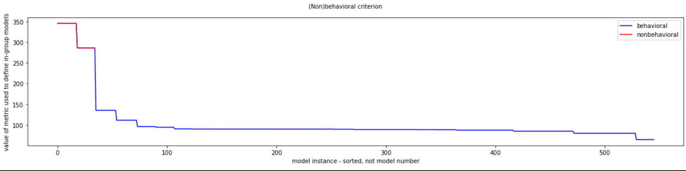
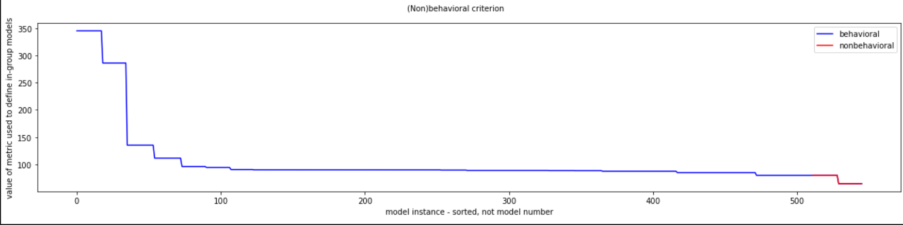
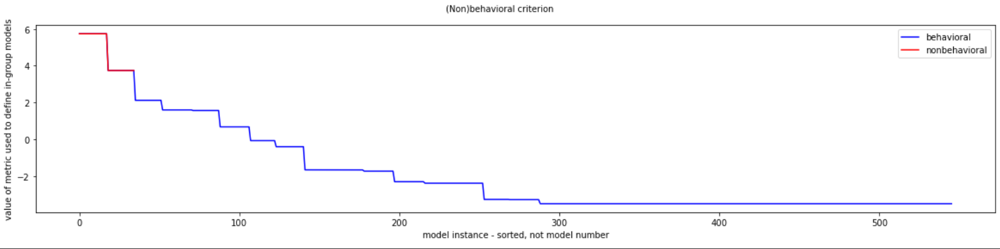
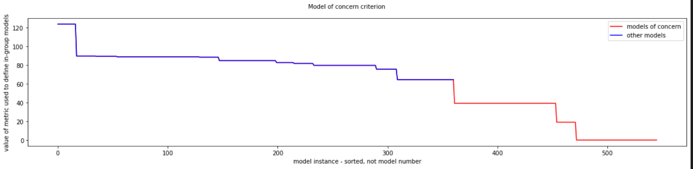
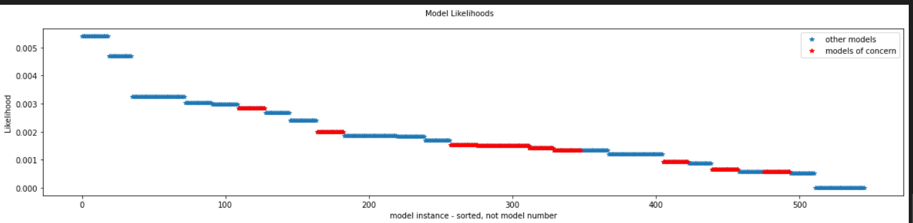
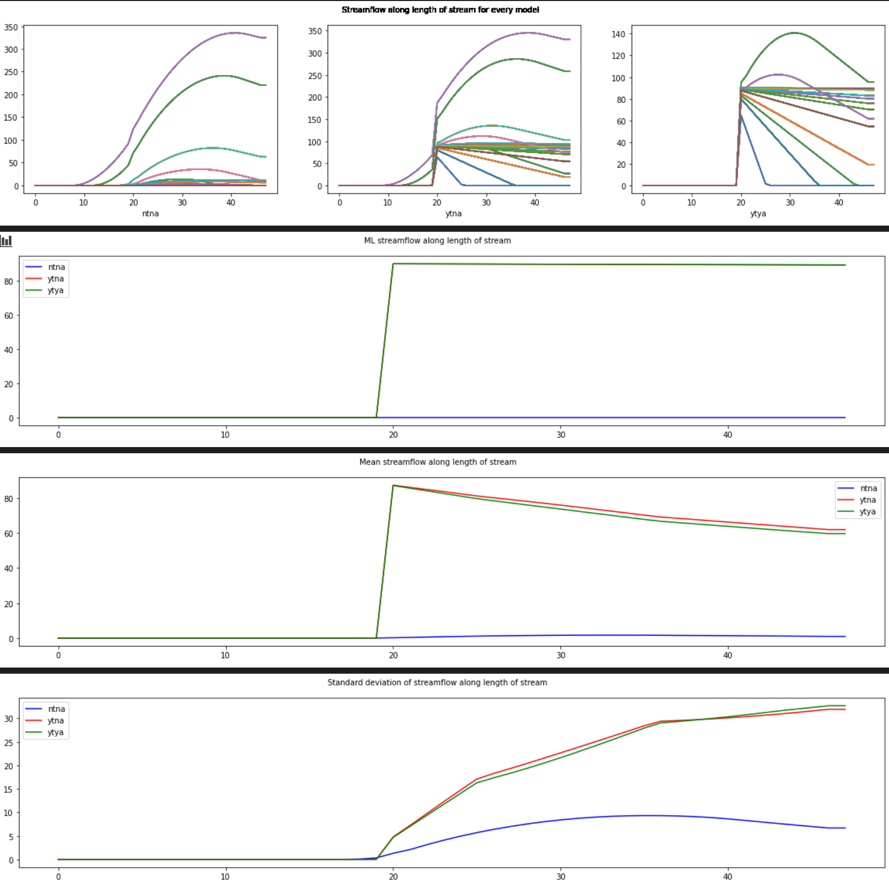
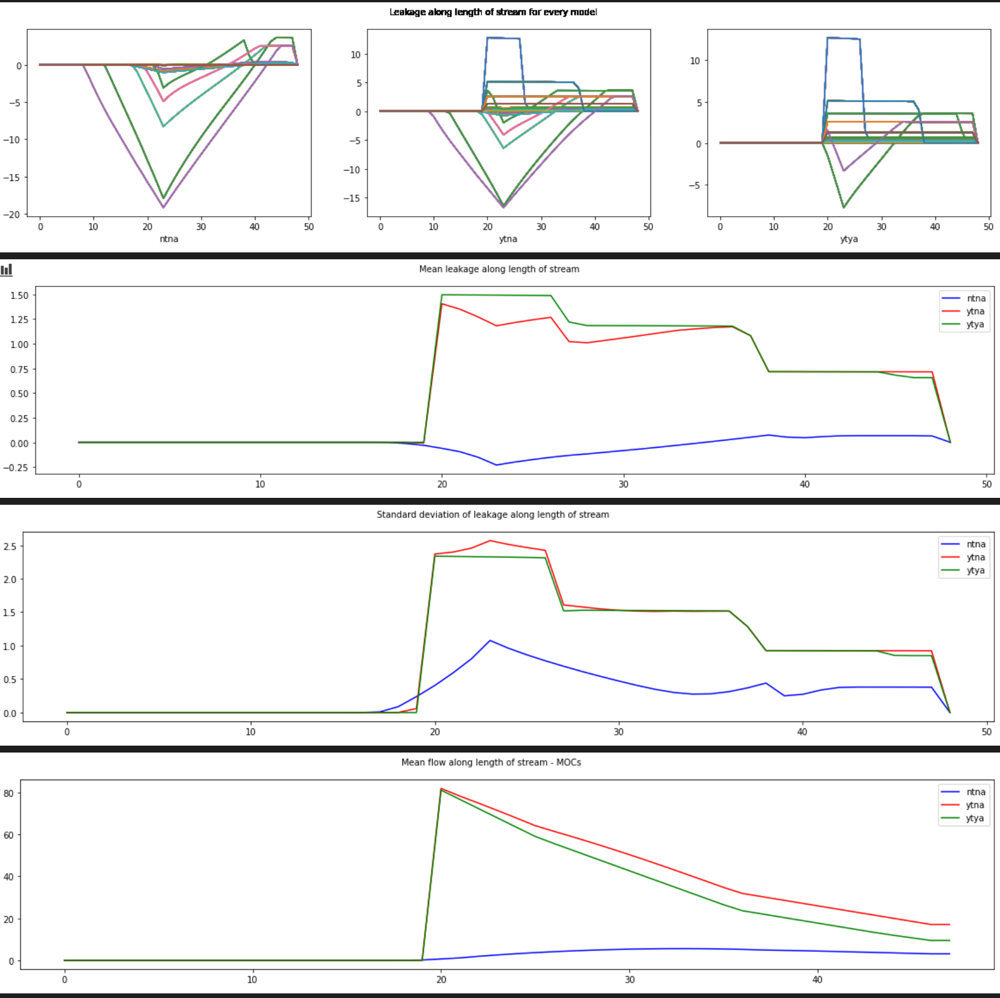
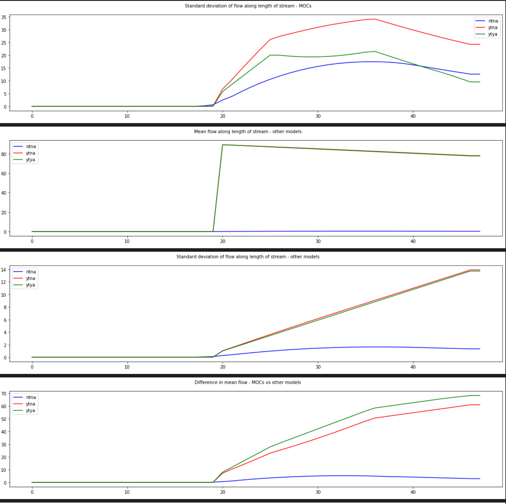
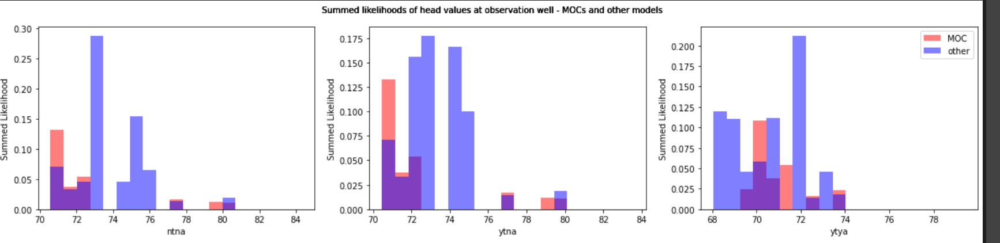

* Quinn Hull
* 04/12/2021
* HW11

## @Ty I never figured this out, but this a placeholder that helpfully I can build upon. 

### Incorrect Figures:

**Ensemble 1**

`There were  185 models of concern.`

### Steps:
1. Get the run_ensemble code running.
2. Empty the current model output directory.
3. Delete all of the m#### files from the output directory.
4. Run run_ensemble.
5. Move the files from current output to output.
6. Run run_ensemble and extract the results that you want.
7. Copy the m### files to a 'hold' directory in case you want that model set later.
8. Set up run_ensemble to add models to your ensemble.
9. Repeat steps 2-8 to augment your ensemble.

### Context:
* Farm - proposal to add a well and irrigate crops
* Task: Use model to determine the risk of:
  * agrochemicals reaching the stream
  * reduced streamflow
  * additional drawdown in the town well
* Conditions:
  * No Town No Ag (NTNA)
  * Yes Town No Ag (YTNA)
  * Yes Town Yes Ag (YTYA)

### Challenge Steps:
1. Describe the scenario being modeled based on the fixed parameter values and the base model parameter values.  
  * Who is the stakeholder?
  * What is their definition of an MOC?
      * MOC = 'Model of Concern'
      *
  * What are the selected 'design' options of the ag facility and the town (return flow fraction, location, field location, etc)?  
  * Essentially, paint a picture of what is being represented by the model.

2. Construct an ensemble with 25 unique parameter sets chosen at random and generate output in current model output.

3.  Remove all of the m### models from output and move all of the models from current model output to output.  

4. Run analyze_ensemble and construct your version of the Key Figures - Ensemble 1.

5. Use the results to identify one MOC and use that to generate 10 additional similar models.

6. Move the m### model results from current model output to output.

7. Rerun analyze_ensemble and construct your version of the Key Figures - Ensemble 2.

### Challenge Questions

1. Based on your initial random ensemble, what is the most likely additional drawdown at the town well due to pumping the ag well?  How confident are you in that response - explain/defend your answer.

2. What is the likelihood that the reality (represented by the meager observed data) is best represented by an MOC?

3. What is the most likely loss in streamflow at the outflow end of the domain?  Justify your answer.

4. Is it likely that either the town or ag well could be contaminated by the ag field?  Justify your answer.

5. Make a set of plots based on ensemble 2 and discuss how each of your answers to the first four questions changed due to adding the MOC-inspired parameter sets.
