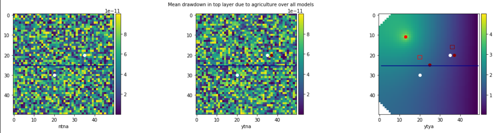
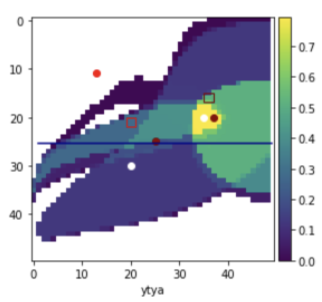
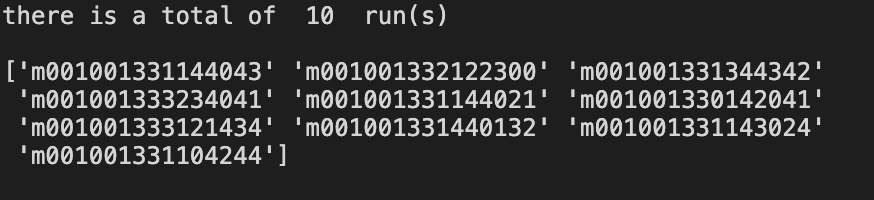

* Quinn Hull
* 04/25/2021 - LATE
* HW11

## Ty Comments:
  * Why is it that when I generate, for example, 25 models in run_class_ensemble, I end up with 475 distinct models in analyze_class_ensemble?
  * How do we isolate assessing just one model? It seems like these graphs all focus on the ensemble performance, not just the ML model.

## 'Correct' Figures:

### **Ensemble 1** Probablilties

 

### **Ensemble 1** Figures

### **Ensemble 2** Probablilties

 

### **Ensemble 2** Figures

## Challenge Questions

1. Based on your initial random ensemble, what is the most likely additional drawdown at the town well due to pumping the ag well?  How confident are you in that response - explain/defend your answer.
  * The initial Ensemble probabilities show that a suite of models `m001001331144043` etc.. is actually the most likely (ML) result from the first run. Each of those 25 or so models individually has a likelihood of approximately a 0.005 likelihood, and total likelihood of a model of concern is 0.217 for the entire ensemble.
  * In assessing this answer, the only figure I have made available is the `mean drawdown in top layer due to agriculture over all models`
    * We can see that the mean drawdown (for all models in ensemble 1) shows that there is unlikely to be any drawdown (< 1 unit of length) at town well due to agriculture

      
  * I'm not super confident in this answer because it only shows drawdown in the top layer (and not in the deeper aquifer layer where the town gets its water). It is also an average (not weighted by likelihood) and so doesn't necessarily represent the 'most likely' outcomes.

2. What is the likelihood that the reality (represented by the meager observed data) is best represented by an MOC?
  * As said before, the total likelihood that the reality is a MOC from this first run is 0.217

    

3. What is the most likely loss in streamflow at the outflow end of the domain?  Justify your answer.
  * To answer this question, I will actually use ensemble 2 and not the base ensemble 1 (I have lost access to this model and its related figures)
  * The figures below show the streamflow along length for different conditions (ntna, ytna, ytya)

    

      * The ML streamflow (first figure) at the end of the domain for ntna, ytna is 0 for the entire streamflow
      * The ML streamflow for ytya ~175 units. I consider this to signify that 'losses' due to agriculture are not even occuring in the ytya scenario. Rather, streamflow in the river is totally dependent on recharge driven by over irrigation
      * For the Mean Streamflow (second figure), we can see that for all scenarios the streamflow picks up slightly from 0 to 10 units in the ntna scenario, however the streamflow in human-influencing scenarios (ytna, and ytya) is order of magnitudes higher. I would classify the difference between the ytna (red) line and ytya (green) line as the 'losses' due to agriculture. In this mean scenario, the loss appears to amount to roughly 20 units of flow at the end of the domain

4. Is it likely that either the town or ag well could be contaminated by the ag field?  Justify your answer.
  * to answer this question we need to look at the ytya figure `Fraction of models predicting capture of recharge in town cell at each cell in top layer over all models`. Here, 'recharge' can be coming from the irrigation area or the induced recharge zone. See below for Ensemble 1 (left) and Ensemble 2 (right)

     

  * Given the locations of the red rectangles, it makes intuitive sense that there is a high likelihood of capture by the agriculture well. These figures confirm this, showing that farm infiltration has a 50% chance, and town recharge has a 60% chance of reaching the town well  - for the initial ensemble. In the second ensemble the likelihood is even higher: 80% for the farm infiltration and 80% for the town recharge of contamination reaching the well.
    * An important note is that this only looks at capture within the 'cell'. So I'm not 100% sure if this means it is the x-y location for all layers, or the actual x-y-z location of the well itself.

5. Make a set of plots based on ensemble 2 and discuss how each of your answers to the first four questions changed due to adding the MOC-inspired parameter sets.
  * I think I have addressed as best I could this concern in the previous four questions. One really nice result that came out of looking at the second ensemble is that, when looking only at the MOC_inspired parameter sets, we are able to show lower likelihood of stream capture or recharge in the second (high likelihood) ensemble relative to the first (random) ensemble.  

    **Ensemble 1**

    

    **Ensemble 2**

    

## Challenge Notes:
1. Describe the scenario being modeled based on the fixed parameter values and the base model parameter values.  
  * Who is the stakeholder?
    * 'env'
  * What is their definition of an MOC?
      * MOC = 'Model of Concern' for an environmental stakeholder
        * moc_time_sequence =       [2] <- YTYA
        * moc_basis_sequence =      [2] <- Basis for determination of behavioral model, in this case 2 = streamflow at specified location
        * moc_comparison_sequence = [1] <- Less than
        * moc_limit_sequence =      [50] <- Behavioral Criterion
        * moc_column_sequence =     [38] <- Column of observation for point 2 or 3
        * moc_row_sequence =        [25] <- Row of observation for point 2 or 3
  * What are the selected 'design' options of the ag facility and the town (return flow fraction, location, field location, etc)?
    * Ag:
      * farm_nw_row=[20, 34, 10, 20, 38]     # north-western corner row of farm
      * farm_nw_col=[19, 19, 19, 10, 10]     # north-western corner column of farm
      * irrig_layer=[0, 0, 0, 0, 0]          # layer to pump from for irrigation well
      * irrig_row=[11, 18, 38, 31, 18]       # irrigation well row
      * irrig_col=[13, 30, 13, 30, 42]       # irrigation well col
      * farm_landuse = 0.125                     # fraction of total farm area in active use at any time
      * farm_efficiency = 0.7                    # fraction of pumped water actually delivered
      *farm_excess = 0.2                        # fraction of crop demand to be added to prevent salinization
      * crop_demands = [0.004, 0.006, 0.008]     # water use (m/day) for each crop [wheat, pistachios, cotton]

    * Town:
      * return_column=[10,15,20,25,30]       # column at which town return flow is added to stream
      * rech_layer=[0, 0, 0, 0, 0]           # recharge basin layer
      * rech_nw_row=[29, 20, 15, 15, 30]     # recharge basin north-western corner row
      * rech_nw_col=[19, 29, 5, 35, 40]      # recharge basin north-western corner column
      * Qw10 = 1000.               # initial pump rate when well 1 is turned on at beginning of post development period
      * rate = 0.0405              # exponentail growth rate of town's pumping
      * town_efficiency = 0.8      # fraction of pumped water actually delivered to town
      * town_consumption = 0.5     # fraction of delivered water that is consumed, not reclaimed
      * well1_loc=[2,20,37]        # location of town well
      * town_recharge_ratio = [0,.25, .5, .75, .9]     # fraction of town's reclaimed water recharged vs. returned to stream (-)

2. Construct an ensemble with 25 unique parameter sets chosen at random and generate output in current model output.
  * I attempted to follow instructions outlined in tutorial, namely:
    
  * Which created in `..._run_class_ensemble.ipynb` 25 models
    

3.  Remove all of the m### models from output and move all of the models from current model output to output.  
  * Okay

4. Run analyze_ensemble and construct your version of the Key Figures - Ensemble 1.
  * When I do this and run the analyzer, I find that I have 460 models!
    
  * See 'Correct' figures

5. Use the results to identify one MOC and use that to generate 10 additional similar models.
  * For this step, I identified that the the highest probability subset of models are all MOCS. Namely. `m001001331144043` and the models listed below and also in the key figure:

    

    

  * To do this, I need to copy and paste this model of concern into the addnames file and select modelgentype = 1 

  * which does the following...

    

  * To generate 10 new models 

6. Move the m### model results from current model output to output.
  * Complete

7. Rerun analyze_ensemble and construct your version of the Key Figures - Ensemble 2.
  * See Correct Figures, `Ensemble 2 Probabilities` and `Ensemble 2 Figures`

### Steps:
1. Get the run_ensemble code running.
2. Empty the current model output directory.
3. Delete all of the m#### files from the output directory.
4. Run run_ensemble.
5. Move the files from current output to output.
6. Run run_ensemble and extract the results that you want.
7. Copy the m### files to a 'hold' directory in case you want that model set later.
8. Set up run_ensemble to add models to your ensemble.
9. Repeat steps 2-8 to augment your ensemble.

### Context:
* Farm - proposal to add a well and irrigate crops
* Task: Use model to determine the risk of:
  * agrochemicals reaching the stream
  * reduced streamflow
  * additional drawdown in the town well
* Conditions:
  * No Town No Ag (NTNA)
  * Yes Town No Ag (YTNA)
  * Yes Town Yes Ag (YTYA)
