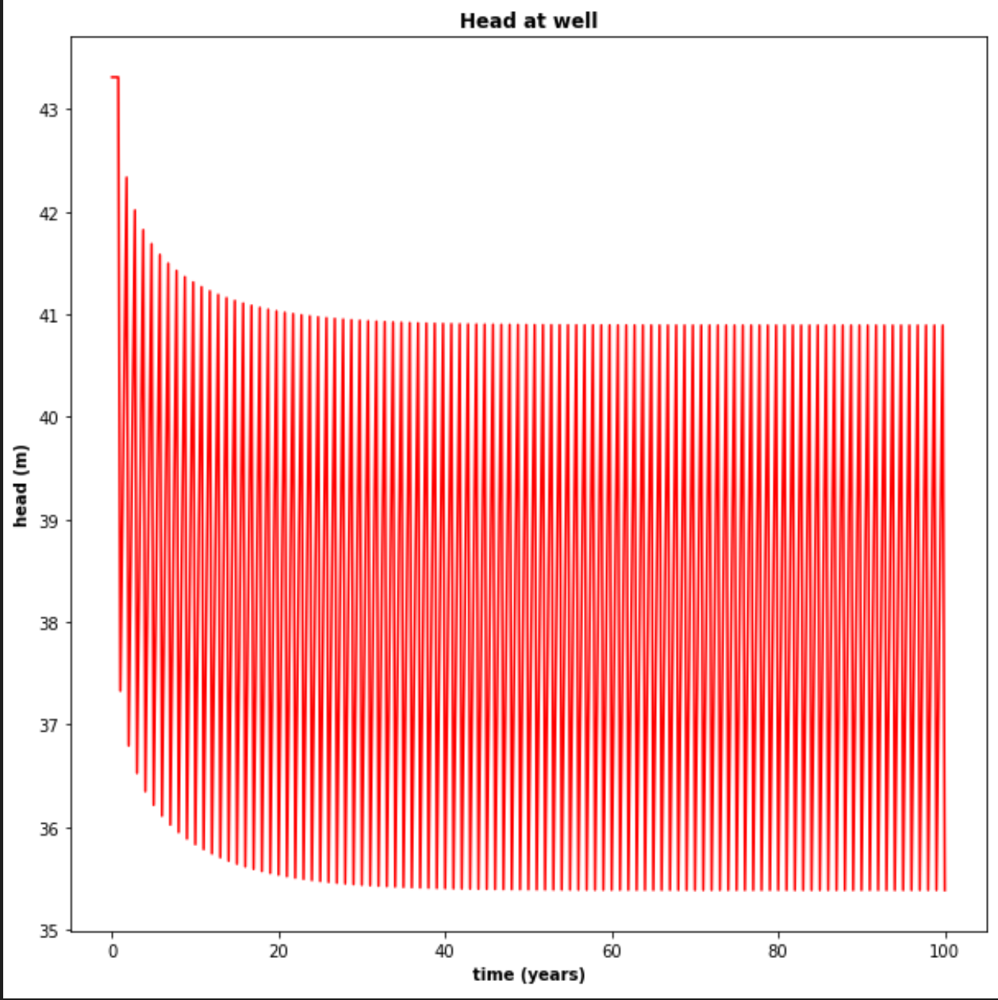
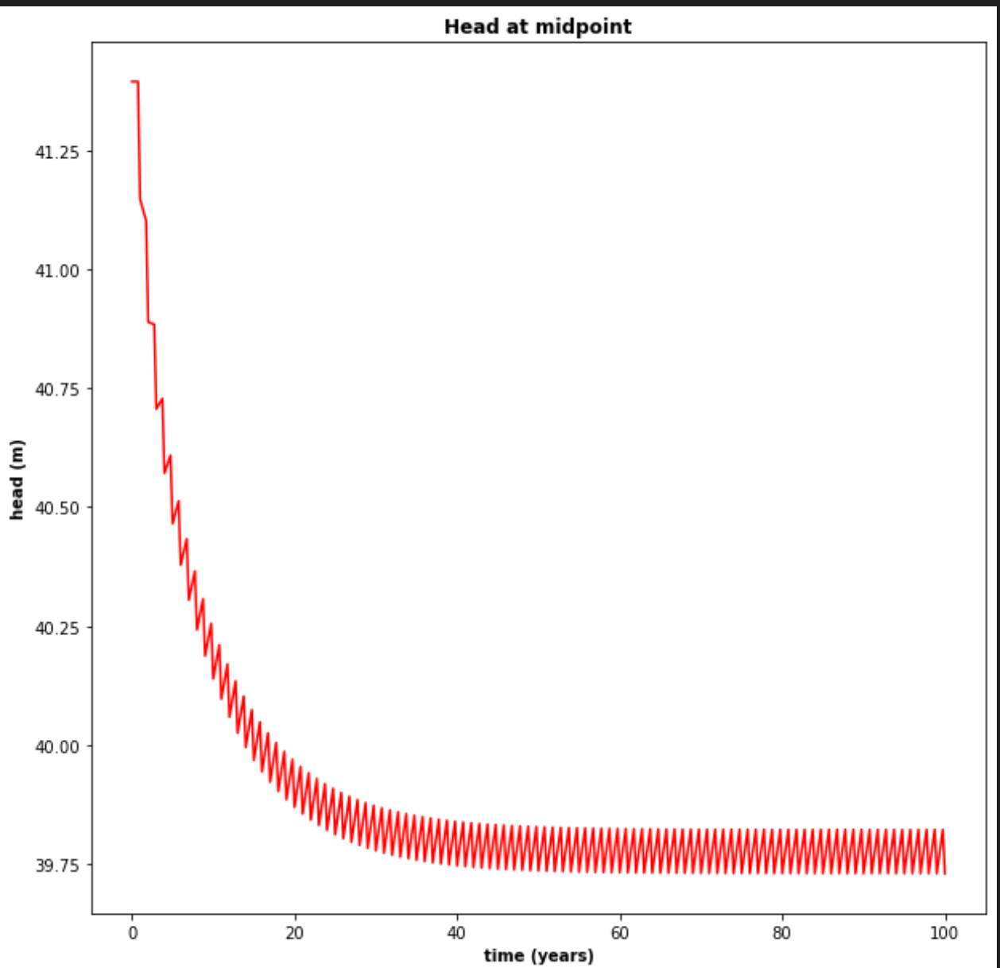
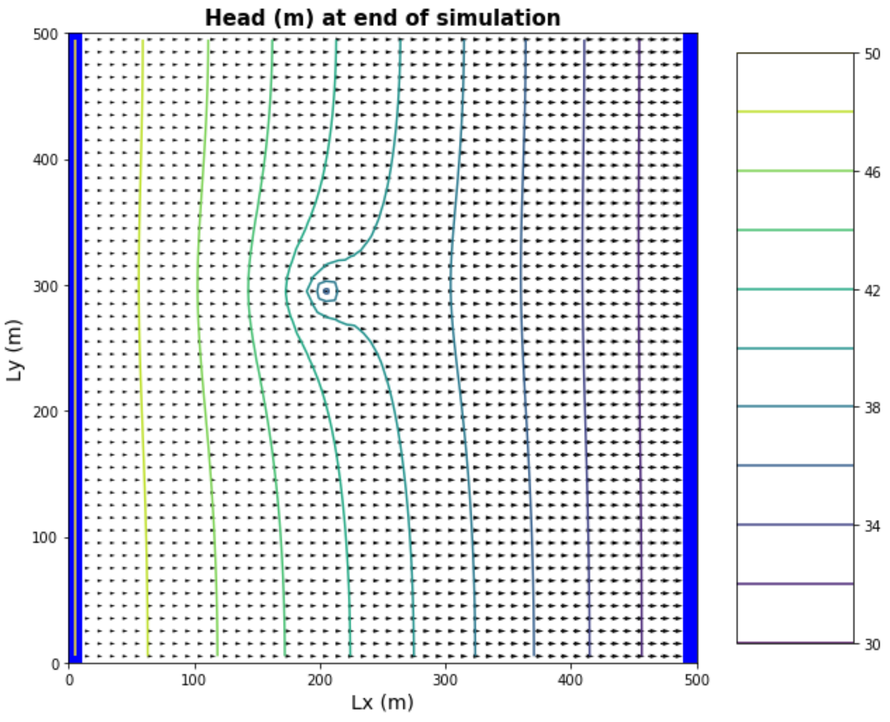
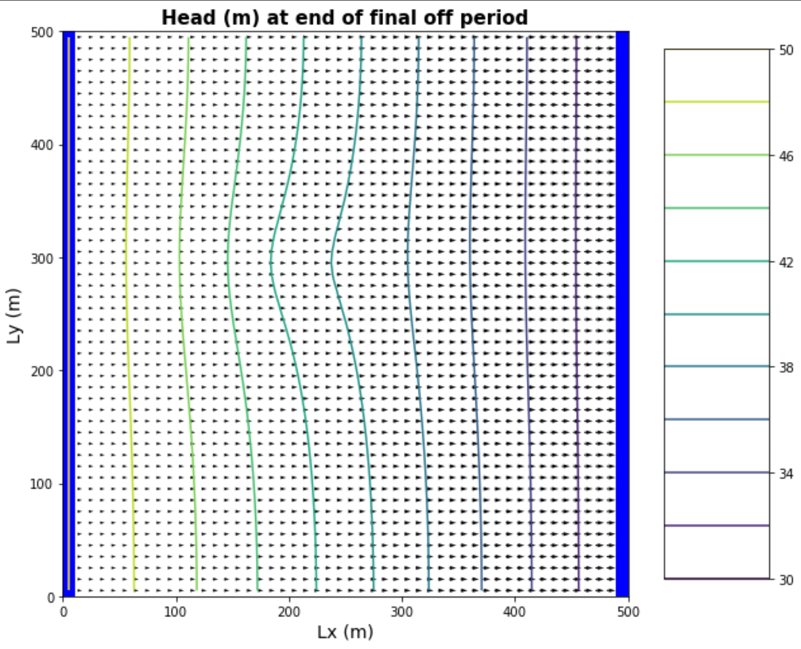

### Transients
  * Quinn Hull
  * 03/11/21
  * HW-07

### The Figures:
a) left panel showing the head at the well and right panel showing the head at the midpint of the domain, both as functions of time over the entire simulation.

**ABOVE** *All years at well*

**BELOW** *Zoom at years 0 - 2, showing pumping periods of 90 days*

b)  The head along a transect between the constant head boundaries through the well at three times: the initial steady state; the final pump-on period; and the final pump-off period.

c) A contour map with flow vectors at three times: the initial steady state; the final pump-on period; and the final pump-off period.

d) A contour map of the drawdown calculated for two periods: between the initial steady state and the final  simulation time and between the final pump-on period and the final pump-off period.

