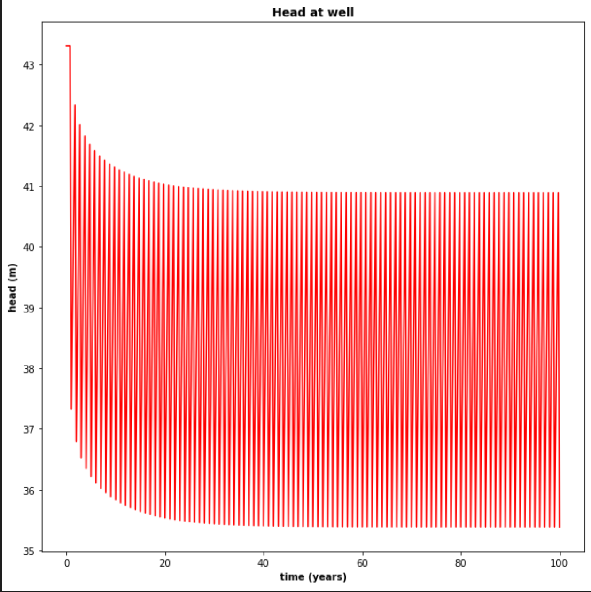
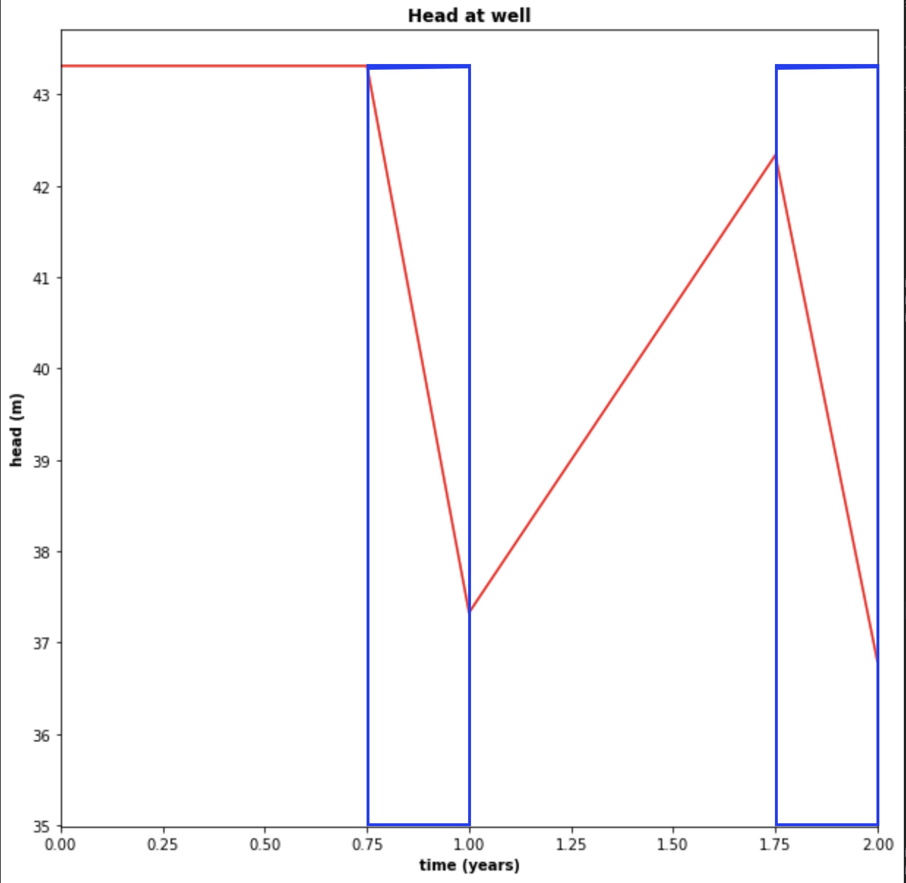
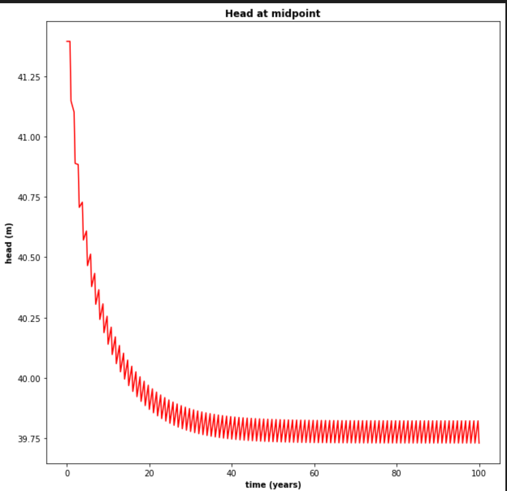
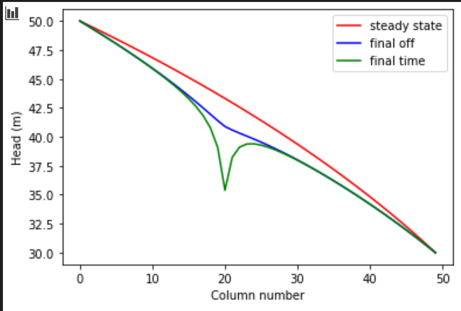
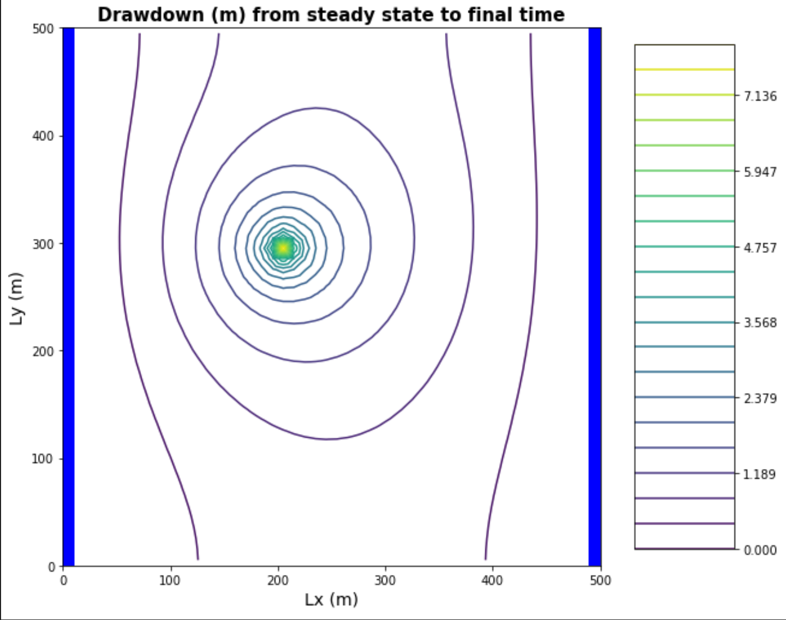
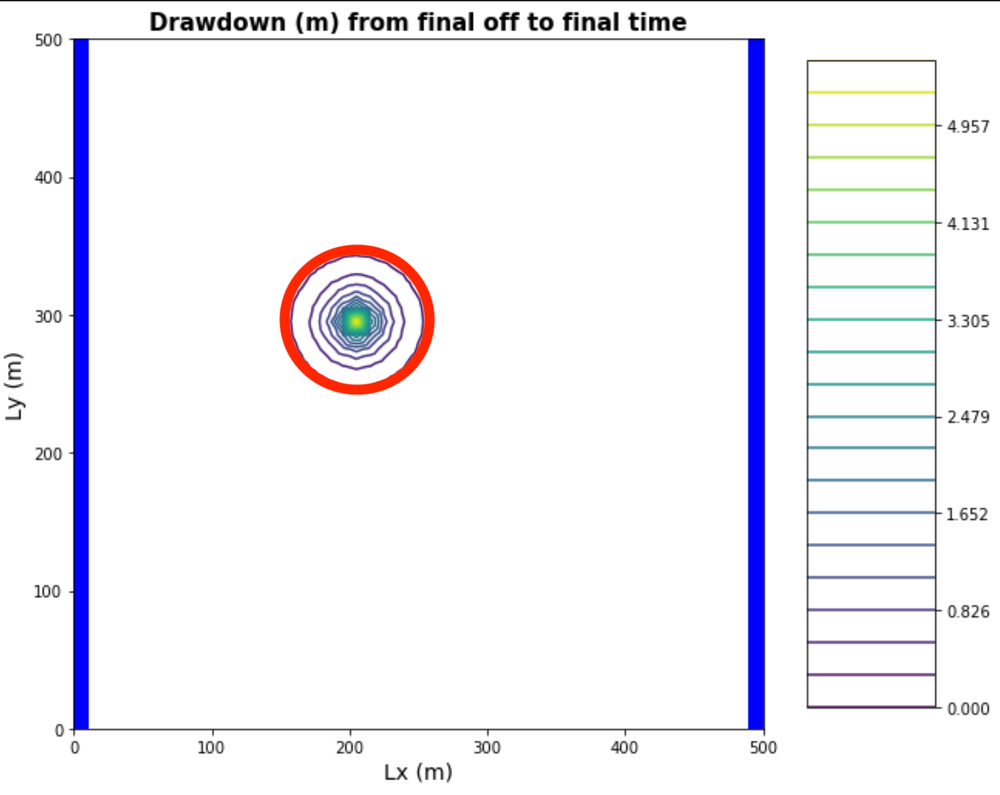

### Transients
  * Quinn Hull
  * 03/11/21
  * HW-07

### The Changes:
  1. Change `sp1` from 40 to 90
  2. Change `sim_years` from 20 to 100
  3. I'm a little confused about what to do from nper etc...
    * Return to 3.2 Temporal Discretization
    * RE: nper - the initial values are overwritten within 3.2
  4. Changed `H_init[:, :, 0]` to `H_init[:, :, -1] = 30 ` for right boundary
  5. Changed `K_horiz = 0.1 ` and `K_vert = 0.1`
  6. Changed `Q1 = 500`, and `Q2 = 0`
    * REturn to 8.1. Should first period be pumping or not?
  7. Changed `recharge = 5e-4 #m/day`, also changed so that it occurs over the entire domain
  8. Inconsistencies - chose the description in 'model description' - so 100 years, not 50 years. And recharge of 5e^-4
  9. Uncommented ET
  10. `5b.1` K_vals[:,:,:] = 0.1  (not = 1)
  11. Run 1:
    - It's really difficult to see the oscillations in head in Figure 1. I think it's because the pumping period is too long!
    - The gradient appears to be oriented in the wrong direction
    - Well is accidentally injecting (not pumping) (whoops)
      * Change - pump well to negative
  12. Run 2:
    This pumping rate really seems to cause issues.
    - Backed pumping off to 10 m^3 / day
    - Changed pumping period so that the first (non pumping) period is 270 days
  13. Run 3:
    - This really worked, repeated with -50
  14. Run 4:
    - This really worked, repeated with -500
  15. Run 5:
    - This doesn't really work. Seems to 'break' the model by having a drawdown that is very very deep!

### The Figures:
a) left panel showing the head at the well and right panel showing the head at the midpint of the domain, both as functions of time over the entire simulation.

b)  The head along a transect between the constant head boundaries through the well at three times: the initial steady state; the final pump-on period; and the final pump-off period.

c) A contour map with flow vectors at three times: the initial steady state; the final pump-on period; and the final pump-off period.

d) A contour map of the drawdown calculated for two periods: between the initial steady state and the final  simulation time and between the final pump-on period and the final pump-off period.

### The Challenges
a) The gradient is not uniform for the initial steady state conditions - discuss the influences of recharge and the unconfined condition on this nonlinearity

b) Determine if the system has reached steady state - consider a point at the well and another at the center of the domain.  

c) Find the zone of influence of the well defined in two ways:
    - Based on the drawdown from the initial steady state to the end of simulation time (end of final no-pumping stress period).
    - Based on the drawdown from the end of the last pump-on stress period to the end of simulation time.

d) How long does it take a point at the center of the domain to reach steady state.  At that point, explain how you could divide the domain into a steady and transient part and solve each separately.

e) Find a constant pumping rate (same throughout the year) that matches the head time series at the middle of the domain.  

f) Find a constant pumping rate (same throughout the year) that matches the head time series at the well, leaving only a regular, repeating seasonal residual.  Are the two pumping rates the same?

g) Discuss the sources of water captured by this well.  If you're up for a challenge, calculate them for the final pump-on period!

h) Discuss how you would define the capture zone of the well.  How is it different than our definitions of capture zone so far in the course?
