### Transients
  * Quinn Hull
  * 03/15/21
  * HW-07

### The Figures:
a) left panel showing the head at the well and right panel showing the head at the midpint of the domain, both as functions of time over the entire simulation.

*a.1 Head at well and moving average*

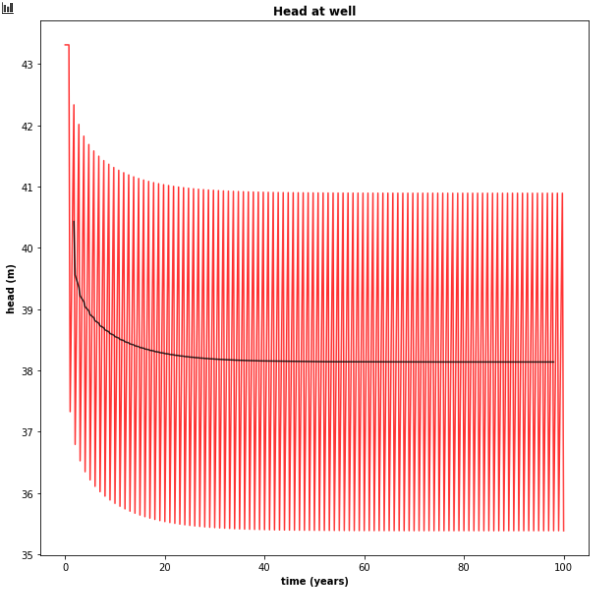

*a.2 Head at well and moving average over two years*

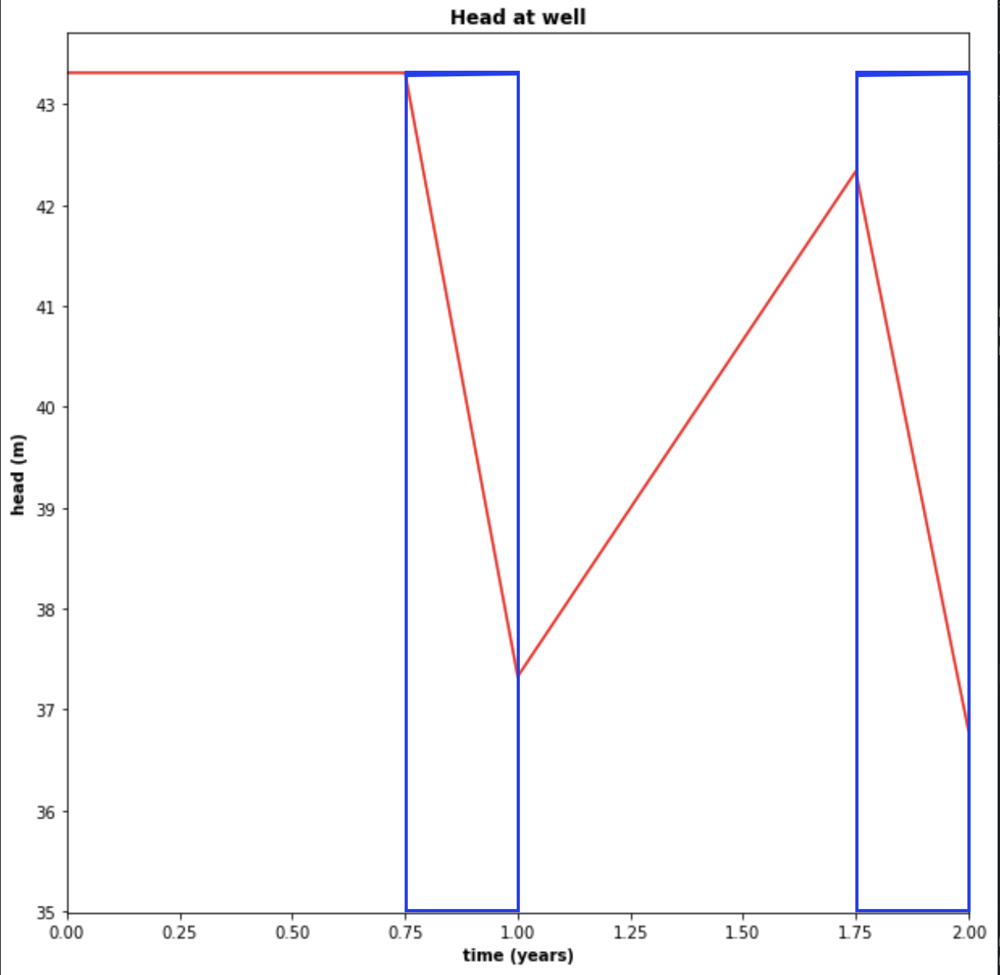

*a.3 Head at midpoint and moving average*

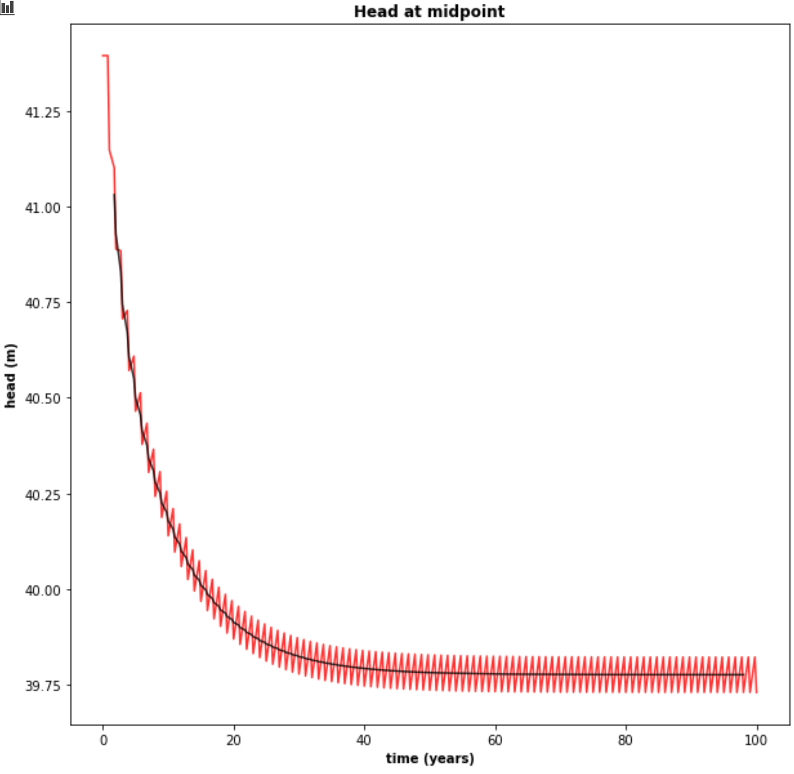

b)  The head along a transect between the constant head boundaries through the well at three times: the initial steady state; the final pump-on period; and the final pump-off period.

*b.1 Head along transect*

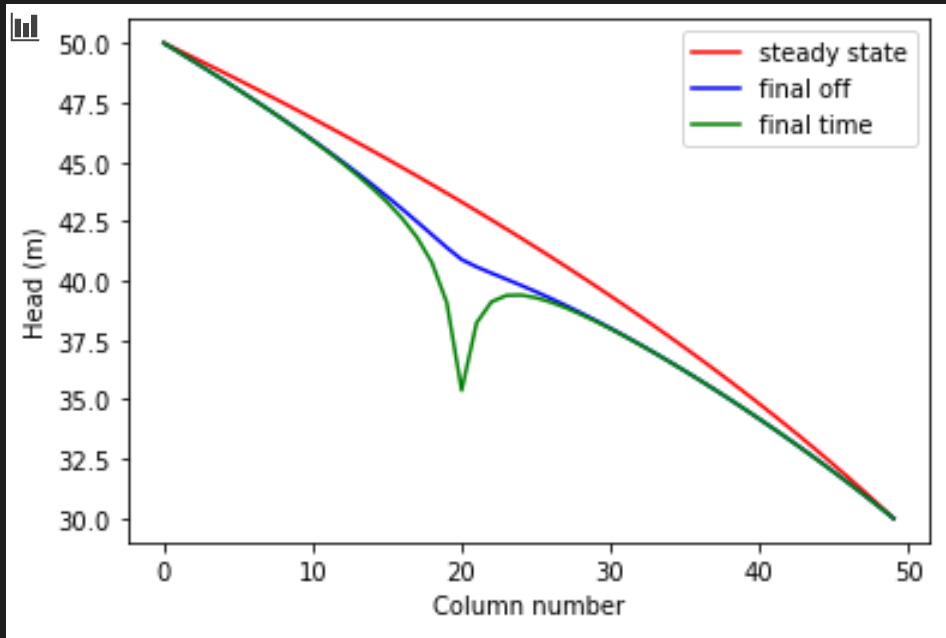

c) A contour map with flow vectors at three times: the initial steady state; the final pump-on period; and the final pump-off period.

*c.1 Contour Map 1, Head*

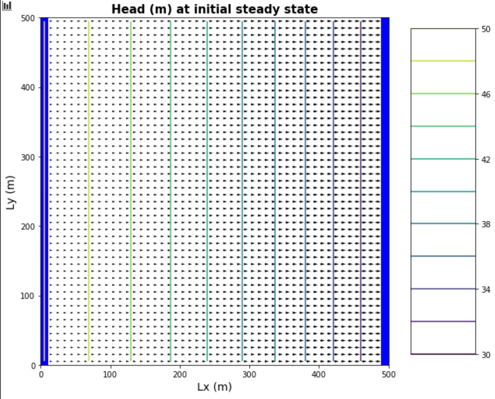

*c.2 Contour Map 2, Head*

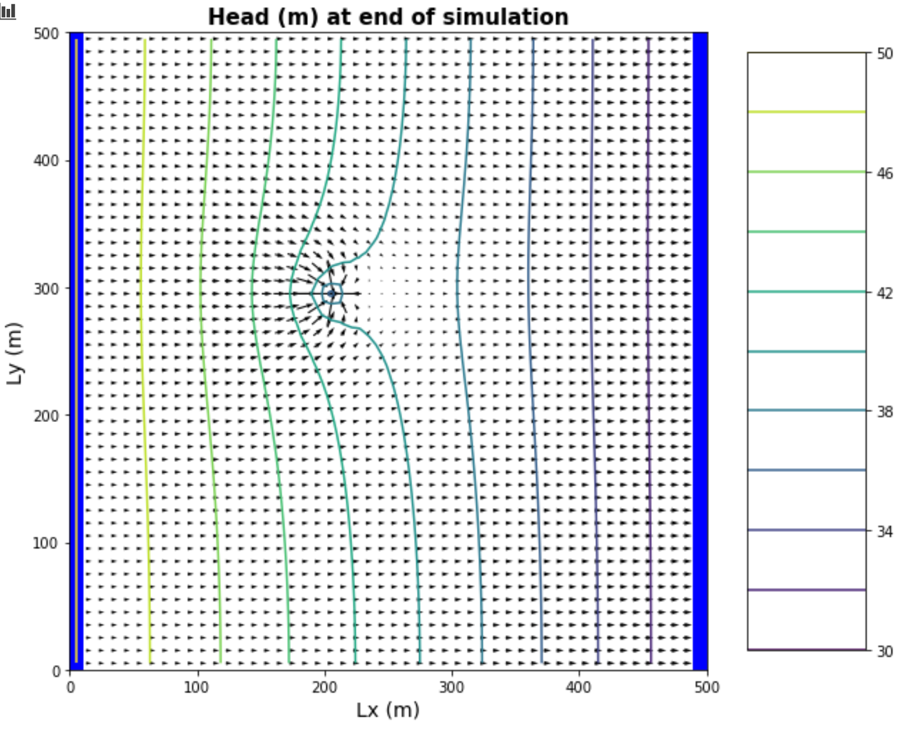

*c.3 Contour Map 3, Head*

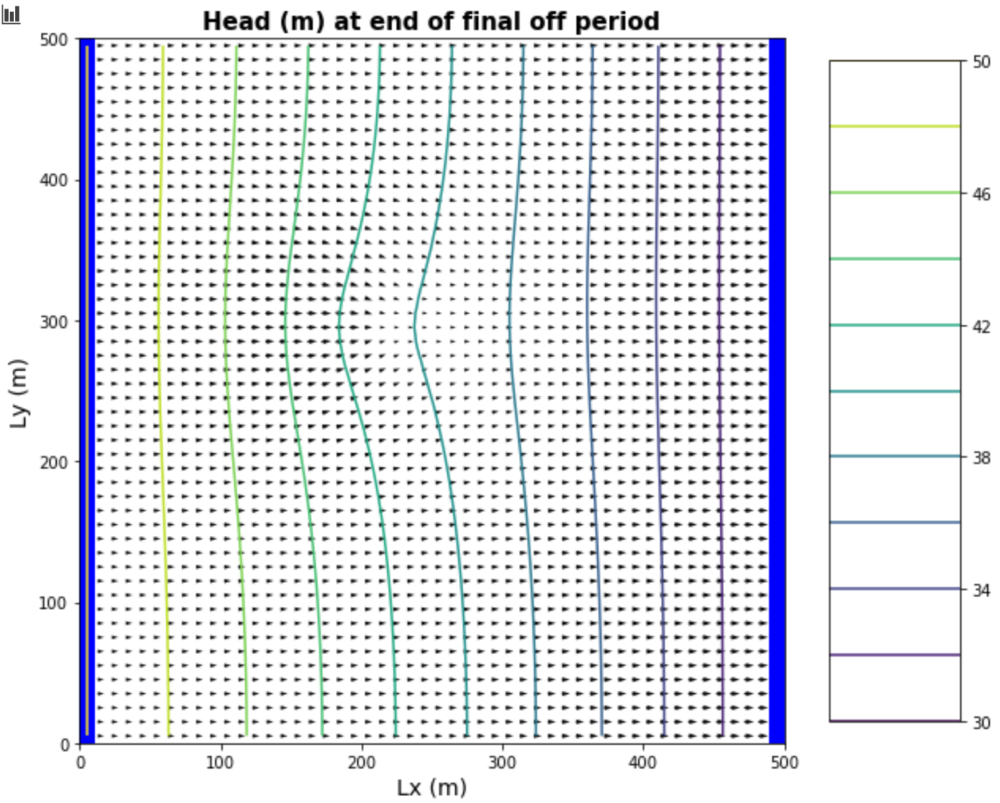

d) A contour map of the drawdown calculated for two periods: between the initial steady state and the final  simulation time and between the final pump-on period and the final pump-off period.

*d.1 Contour Map 1, Drawdown*

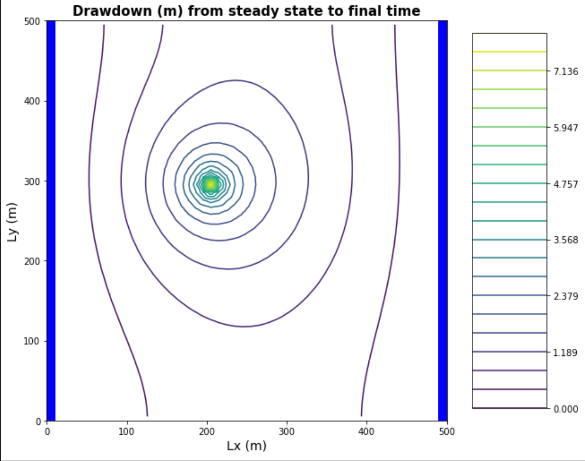

*d.2 Contour Map 2, Drawdown*

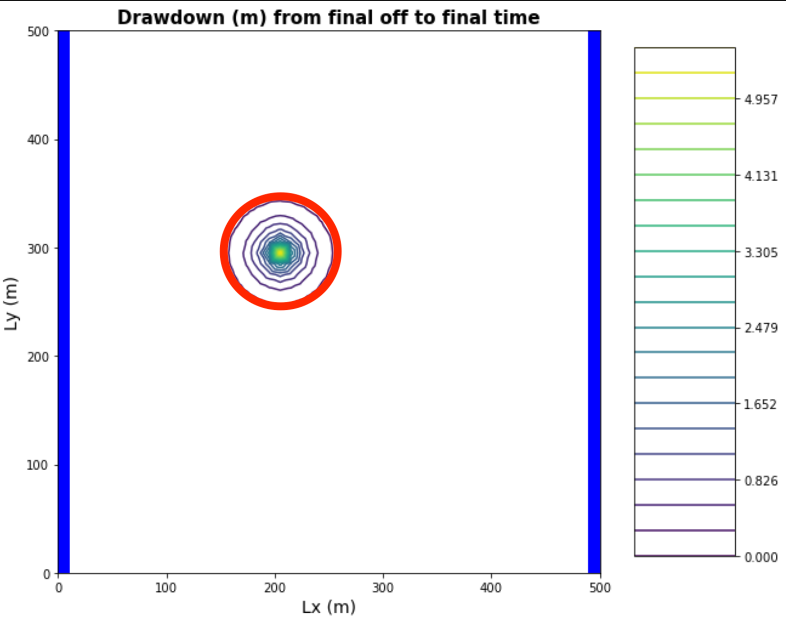

### The Challenges
a) The gradient is not uniform for the initial steady state conditions - discuss the influences of recharge and the unconfined condition on this nonlinearity.

  - The gradient is not uniform primarily due to it being an unconfined aquifer. We have seen from previous exercises that this nonlinearity is a function of decreasing aquifer thickness (approximated in modflow like a decrease in K).
  - Changes in recharge rate will affect the decrease of convexity of the head curve, but not the shape of the curve itself
  .
  - Note that a uniformly distributed recharge rate in a confined aquifer *would* cause the hydraulic gradient to not be uniform (ie curved), whereas a confined aquifer without any recharge would have a constant (i.e. linear) gradient

b) Determine if the system has reached steady state - consider a point at the well and another at the center of the domain.  

  - I think this is a question of not just where, but when. We can consider 'steady' state to be some point in time where over the course of a year the heads are no longer decreasing and have stabalized. From visual inspection, we know that must be some point after year 40 for both midpoint and pumping well, but they don't appear to be identical.
  - Steady state is also a question of 'how' (i.e., 'how steady'). The code snippets below extract a moving average from the midpoint and well, take the difference between the moving average at times t and t-1, and (using an arbitrary 'tolerance' where the difference between time-steps is approximately zero), pulls out the year at which we reach steady state.  According to this method:

    * `the first steady state year at well is, 67.0`
    * `the first steady state year at midpoint is, 66.0`

          # extract and plot head time series at specific points
          time_series1 = headarray[:,domain_centerpt[1],domain_centerpt[2]]
          time_series2 = headarray[:,well_loc[1],well_loc[2]]

          n_in = 8
          time_series1_mv = moving_average(time_series1,n_in)
          time_series2_mv = moving_average(time_series2,n_in)
          elyears_mv = elyears[int(n_in/2)-1:-int(n_in/2)]

          tol = 5e-5 # the tolerance to set as 'steady'
          # locate steady state
          time_series1_mv_diff = time_series1_mv[:-1] - time_series1_mv[1:]
          time_series2_mv_diff = time_series2_mv[:-1]  - time_series2_mv[1:]

          # first year where head does not change
          print('the first steady state year at well is,', elyears_mv[:-1][time_series1_mv_diff < tol][0])
          print('the first steady state year at midpoint is,', elyears_mv[:-1][time_series2_mv_diff <= tol][0])

c) Find the zone of influence of the well defined in two ways:

- Based on the drawdown from the initial steady state to the end of simulation time (end of final no-pumping stress period)
  > The figure below shows that at the end of the last no-pump period, the drawdown is limited to the area immediately around the well

  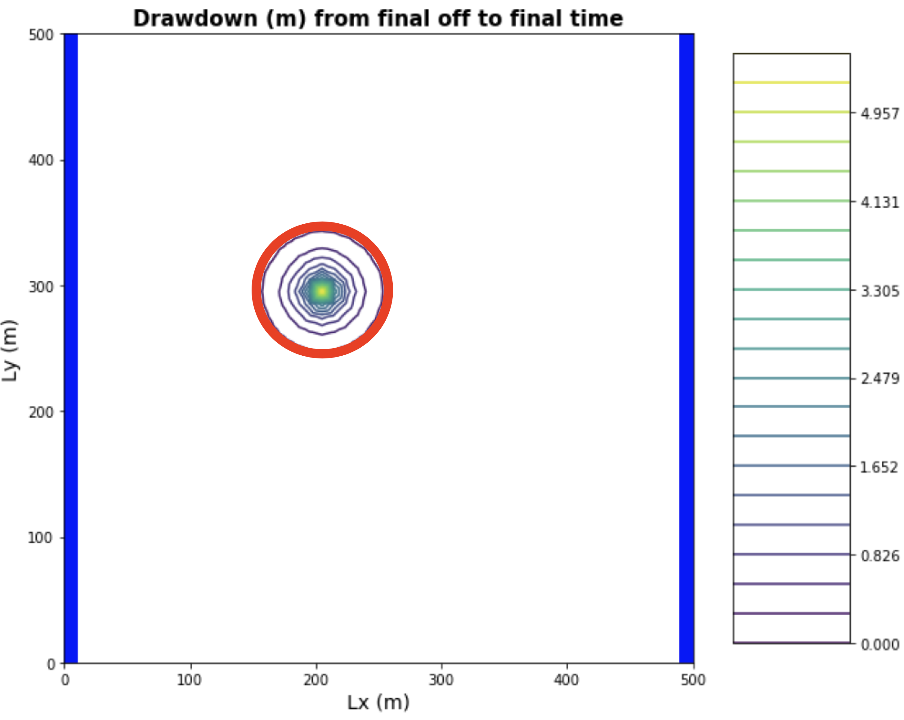

- Based on the drawdown from the end of the last pump-on stress period to the end of simulation time.
  > Figure d.1 shows that the entire domain is basically within the zone of influence after the final no-pumping stress period

d) How long does it take a point at the center of the domain to reach steady state.  At that point, explain how you could divide the domain into a steady and transient part and solve each separately.

  - It took ~ 60 years for a point in the middle of the domain (near pumping well) to reach steady state (see question b).
  - We can see from figure d.2 that the area enclosed in the red circle around the well is transient (in the sense that periods of pumping and recharge cause changes in head through time), whereas the area outside of the red circle could be treated effectively as steady state. With this in mind, we can see how we might solve each part of the model seperately.  Keeping the transient condition to the zone enclosed within the circle would simplify (computationally) the task substantially, especially with a really large model domain!

e) Find a constant pumping rate (same throughout the year) that matches the head time series at the middle of the domain.  

f) Find a constant pumping rate (same throughout the year) that matches the head time series at the well, leaving only a regular, repeating seasonal residual.  Are the two pumping rates the same?

  - I'll answer both e and f together. It appears that at the middle of the domain, a constant pumping rate = 250 m/d matches really well the moving average (central tendency) of the head through time. At the well, that same pumping rate = 250 m/d is close, but slightly higher than, the moving average of head through time. By induction, this would suggest actually that the pumping rate -> steady conditions is actually different at these two locations. But I tend to think that perhaps I am mis-interpreting this; I don't see why there would be a difference...

   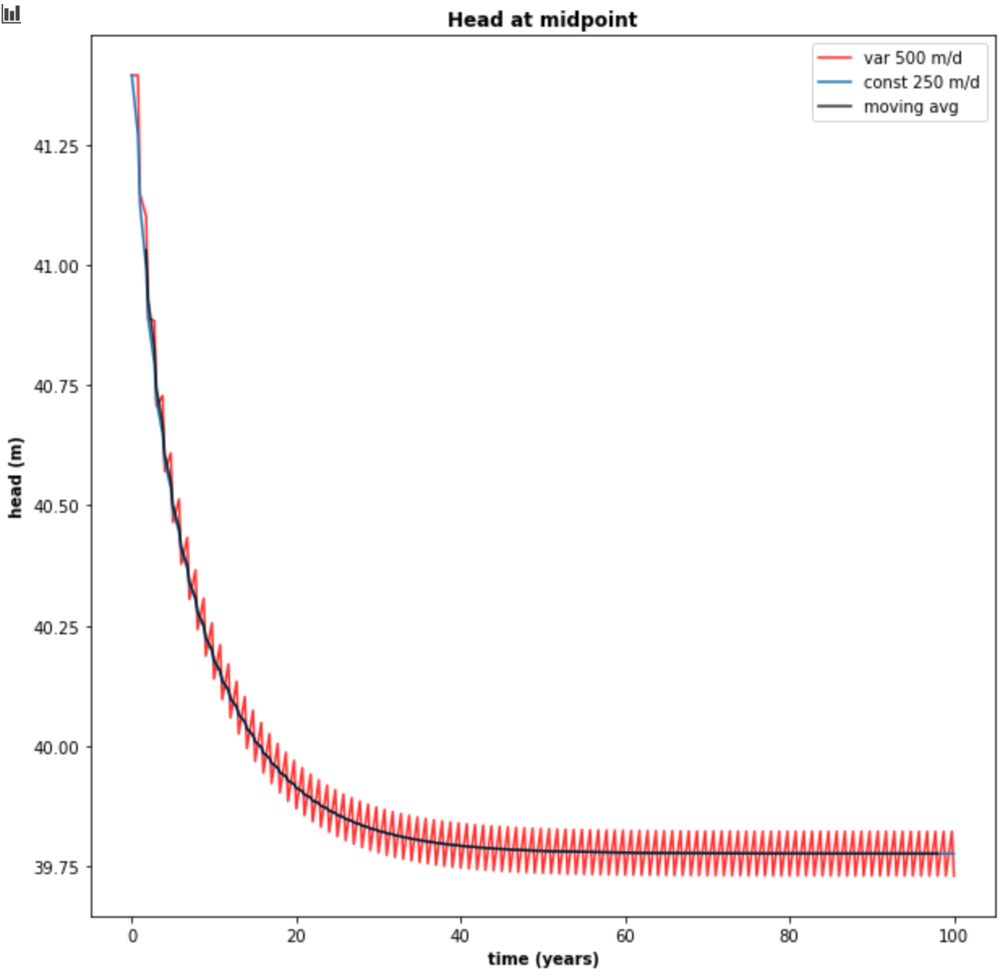

g) Discuss the sources of water captured by this well.  If you're up for a challenge, calculate them for the final pump-on period!

h) Discuss how you would define the capture zone of the well.  How is it different than our definitions of capture zone so far in the course?

  - I'll try g and h together. The 'sources' of water captured by this well are generally coming from the left boundary, and the recharge enclosed in red area shown below. It's important to note that this apparent 'capture zone' changes with time. I.E. if we were to draw a similar figure for the pump off period, the zone would be somewhat smaller. This zone is enclosed in blue. (Note that the head contours used to draw this zone are not shown in this figure). I'm still not clear on if the 'true' capture zone is in fact the larger red area, the small blue area, or some space in between. I imagine there is an opportunity for flow vectors to be redirected towards the well during pumping but scoot on by during a no pump period. We might be able to define a 'true' capture zone by just assuming a constant pumping rate like in questions e and f.

    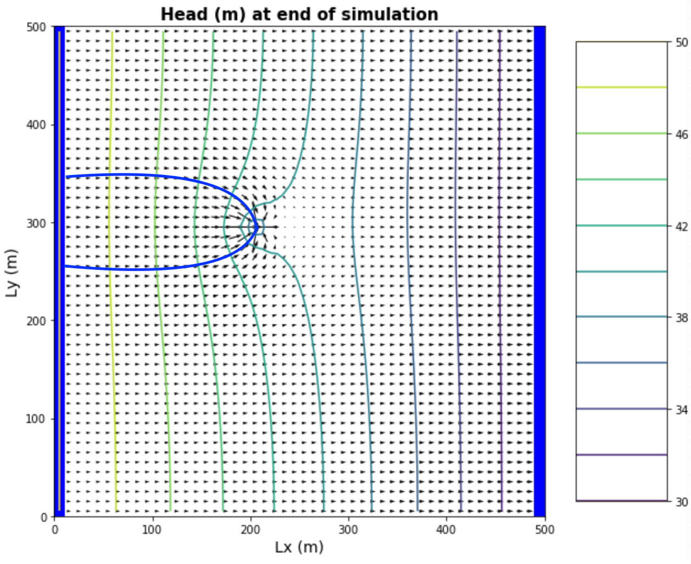
