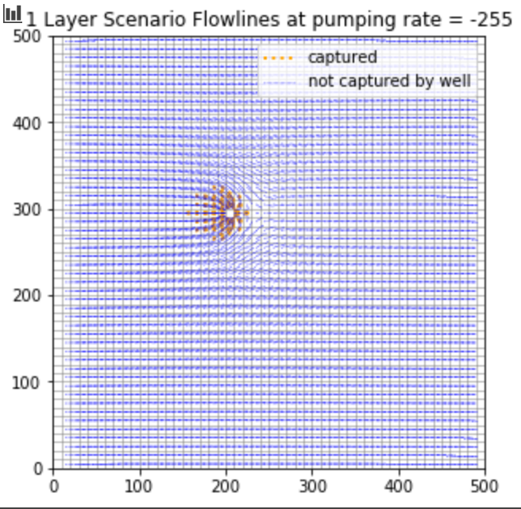

* Quinn Hull
* HW-08
* 03/29/2021

# The Challenge

### a) How does the capture zone evolve in time?  Where does the early time capture zone get its water?
  * An important note is that it is easiest to observe the capture zone at different times (25, 50, 75, 100) not by doing particle tracking with transient flow conditions, but by setting pumping rates to equivalent head conditions in and around the well at t = 25, 50, 75, and 100).
  * This is a bit of a project, because I'm not 100% certain how to calculate flow lines using a transient condition
  * So instead, I chose to figure out the capture zone at each time using the steady pumping rate equivalent of the transient condition for each time step. Pseudocode below:
    * Calculate moving average of head at well for transient (25% pumping, 75% recovery) condition
    * Derive representative head from moving average at each t = 25, 50, 75, 100. This is simply a matter of pulling out the head as a scaler at each of these time steps.
    * Plot the representative head on the plot for each time step. Note that the representative head for yrs 50, 75, and 100 are approximately equal because the system is at cyclical steady state. As such, there are only two conditions we need to consider the capture zone for, t = 25, and t >= 50
    * Match (via trial and error) a constant pumping rate that generates steady head at well equivalent to the representative head for each condition t = 25, and t >= 50.
      * Constant pumping rate results:
        * For t = 25, a good representative pumping rate is 250 m^3 /d.
        * For t >= 50, a good representative pumping rate is 255 m^3 / d.
        
    * Use these equivalent constant pumping rates to do particle tracking with the one layer model.

-----------
**UPDATE: MONDAY**

  * After some frustration, corresponding with Dalia, Luis, and Gillian about the expectations for this week, I wasn't able to set up the model in the way that I had hoped.
  * Instead, I opted to just modify the 'Ford' scripts a little bit. **The key insight is that this uses a 'sensitivity analysis' of different pumping rates to explore who the capture zone may evolve through time in a transient model.**
  * Result - We can see that the capture zone is larger at higher pumping rates. This doesn't exactly translate to an answer to your question, of course, because it was a question about a transient model. We can feel pretty confident that if the lower pumping rates would correspond to early time steps, and that at some point the capture zone would stabalize. So the highest pumping rate tested may not represent a 'realistic' late time capture zone. However, we haven't identified a transient state that we are trying to emulate, so really any comparison of this sort is inappropriate.

    * Model details are the following:

        1. Model Description
          This is a steady state box model with recharge

        2. Dimensions:
          - 50 by 50 by 1
          - dx = dy = 100 m
          - dz = 100 m  

        3. Topography
          - Land surface 100m

        4. Subsurface Properties:
          - Homogeneous
          - K = 1.0 m/day in x and y and 0.1 m/day in z.  
          - Porosity = 0.35
          - Specific yield = 0.03
          - Storage coefficient=0.001  

        5. Boundary Conditions:
         - Left boundary constat head 85m
         - Right boundary is a constant head of 75 m
         - Recharge occurs at a rate of 5E-5 m/d uniformly across the domain

        6. Well:
         - Pumping well
             - Located at (3000, 2500)
             - Pumping at a rate of Q m^3/day
             - steady state
             - Different conditions explored: Q = 100, 500, 800, 1200, 2001, 2200, 4000
             - These pumping conditions can be thought of as 'end members' (500, 4000), and then 'representative of different time slices at t = 25, 50, 75, 100

        7. Recharge and ET
        - No ET
        - Recharge occurs at a rate of 5E-5 m/d uniformly across the domain

        8. Layered Scenario
         - 3 layer zone
         - Low K layer - Kx=Ky=Kz=0.00001m/d
         - Top Layers = K = 1.0 m/d
         - Extending form 40-50m above the base of the domain
         - The well is only completed in the lowest layer

### b) Where does the 'infinite time' capture zone get its water?
  * It's not really possible for me to answer this question with respect to the model domain desired

### c) How does the extent of the capture zone change when layers are considered?  Can you still define a 2D capture zone??
  * In general, the capture zone is smaller when layers are considred. Namely, there is no capture from the shallowest layer (unless the pumping rate is exceptionally high)

### d) How does the extent of the 'infinite time' capture zone change when layers are added?  Explain any difference in the lateral extent of the capture zone along the left boundary.
  * I'm not sure I understand this question. @Ty can you explain what you mean by this?

# Key Figures

### a and b) [COMBINED] Time capture zone for four times and and infinite capture zone with and without layers.  You can combine these into one figure or show a separate figure for each time.

  * The following figures show flowline scenarios at different steady state pumping rates for the one layer model. We know that **Q = 255** is approximately equivalent to capture zone at **t >= 50**, and **Q = 250** is appoximately equivalent to capture zone at **t = 25**

  * These results (of course) don't make sense! Everything seems insensitive to pumping rate. Perhaps there is a bug in my code?

  * I wasn't able to add layers and get particle tracking results to this model.

      

-----------
**UPDATE: MONDAY**
  * As was stated earlier, we were unable to run the model the way we wanted to test the effects of pumping on the domain from last week.
  * The results below show the capture zone of the well for different pumping conditions `Q = 100, 500, 800, 1200, 2001, 2200, 4000`

        

  * Even though in general the 3 layer model doesn't see capture from the shallow layer, we can see that increasing the pumping rate definitely yields influence on the direction of flow paths in that shallow layer.
  * It's worth noting (and definitely a bit interesting) that the higher pumping rates (2001 - 2200) capture all the water coming from the boundary, and that the highest (4000) is the only one that shows capture from the top layer by the bottom layer well.
