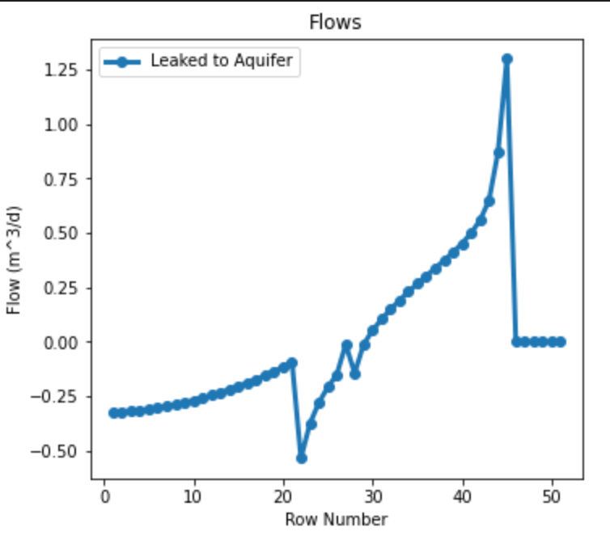
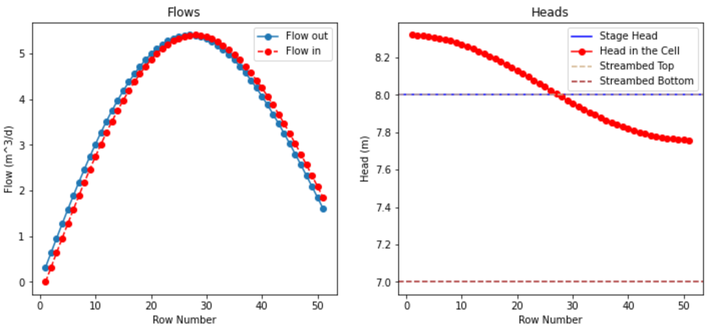
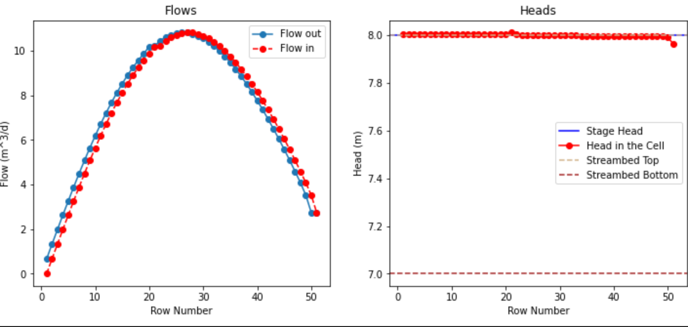
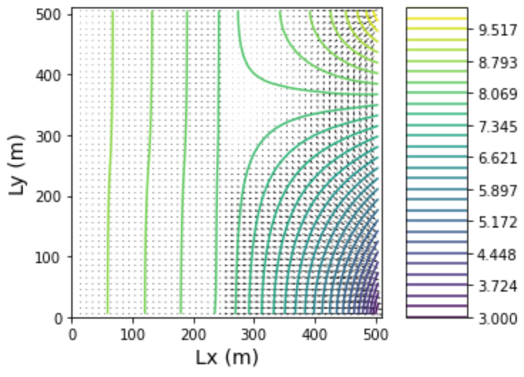
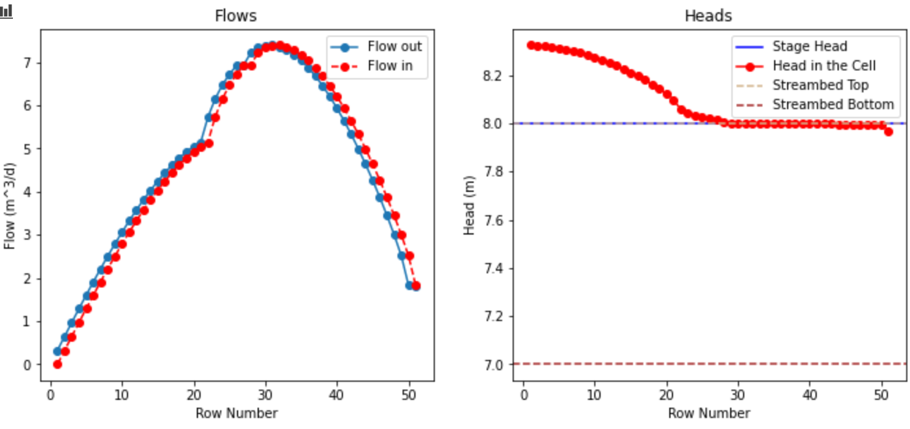
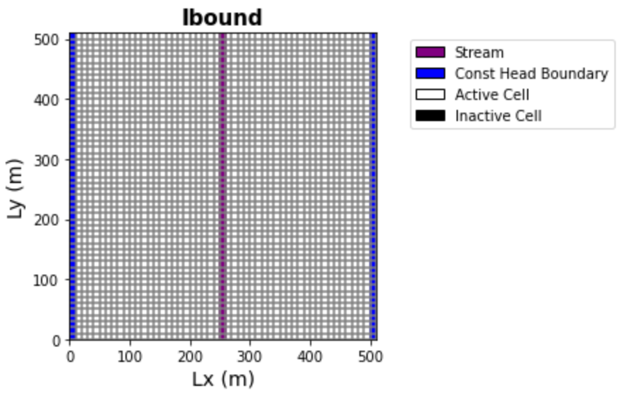
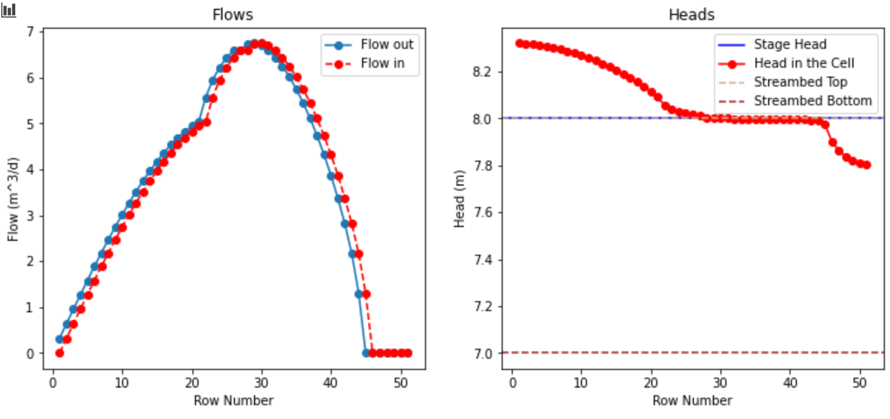
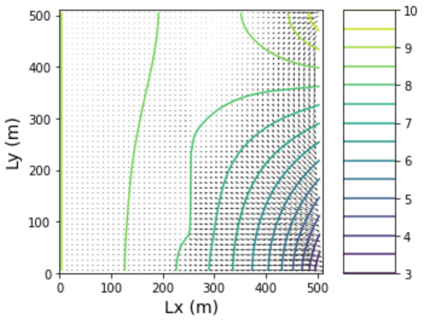

* Quinn Hull
* Week of 04/05/2021
* River of Dreams   

### Questions
1. I'm a little confused about the usage of 'f' and 'm' in comments, it seems like maybe this referes to the units of length, where f = feet. But this is probably a typo...
  - Jill - 'It also confused me that there was a mix of meters and feet when defining the STR object.  I just chose to ignore it and pass it off to messy comment housekeeping and assumed all meters.'

2. Given that the boundaries exist at the left and right sides, I don't really understand how this river originates and terminates at the north and south (so to speak)
  - Jill - 'I also struggle to conceptualize this.  Might not be the realest life representation maybe but more of an exercise of component interactions?   Maybe a good topic of discussion for Tuesday!'
  - Quinn Followup - We can actually change whether or not there is flow at the origin, which is kind of like a defined flux boundary (in a way)

3. I'm not sure about how to interpret the final part of the rivers (3). It seems like there is no flow in the river, and yet the head in the cell is technically above streambed bottom. This could be a conceptual issue in my understanding of the problem. Or it could be that the model doesn't fully capture the dynamics of flow in a stream. Which is it?
  - Jill - 'also a great conceptual question that i didn't even consider until you mentioned it!    So the streambed bottom is at 7m, but then there is the 1m of sediment (assuming units) so the bottom of the open channel is at 8m, wonder if that could that be a factor somehow??   But then this brings up another conceptual question for me too thinking along these lines - the initial code user inputs for STR object definition sets the "stage_above_datum" as 9 m3/day (top of streambed is at 8m).   What is that doing for us?'
  - Quinn Followup - @Ty it would be really great to talk about this and break it down

### Model Characteristics
* Single Layer Model, 51x51x1 (each cell 10x10x10 m)
* Stream runs along center of domain (@ Col ~ 25)
  * K changes within three zones along the stream
    * rows 0-20 - low K (1/100)
    * rows 21-26 - medium K (1/10)
    * rows 27-50 - hi K (1)
  - Inflow to first reach = 0 m3/d
  - Streambed slope = 0.0001 m/m
  - Streambed rough = 0.02377
  - Streambed width = 20 m
  - Streambed thickness = 1 m
  - Stream bottom depth = 7 m
* Unconfined Aquifer
* Recharge:
  * Unifrom 5e^-5 rows 0-26
  * Uniform 0 rows 27-51
* No ET
* Boundaries:
  * North and South = No flow...
  * Left = Constant Lake Head (=9)
  * Right = Constant Lake Head (=np.linspace(10,3,51))

### The Challenges
**a) The code is provided to produce the first set of 'correct' figures.  Use these figures to describe the nature (direction/magnitude) of stream/aquifer exchange along the stream.  In particular, explain why the leakage changes magnitude or direction where these values change.**

**b) Use the head distribution to describe the movement of water across the boundaries and into/out of the stream.**    

  * For me, it is easier to understand the the nature of stream/aquifer exchange by looking at a more detailed figure of the contour map.

  

  * Here, the river (column 25) is divided into three parts:
    1. Fully gaining - rows 0-12, color sky blue.
    2. Partially gaining / losing - rows 12-45, color red.
    3. Not flowing - rows 45 - 50, color pink.
  * In the fully gaining portion (1), groundwater enters the river from both left and right sides of the domain. (Direction = into River; Magnitude = large on L, large and decreasing on R).
    * As the right boundary decreases in head from 10 to 3, groundwater flow on the right side of the domain starts getting rerouted from the central river back to the right boundary (which experiences a far larger drop in head over its reach). We can show that when the contour line ~8.2 crosses the central river, river begins entering the groundwater system on the right side. This is shown in an accompanying decrease in the rate of increase of flow at that point.
    * It's important to note that the amount of water leaving the domain is buffered by 1) the relatively low conductivity of the sediment material, and 2) the dependable inflow from the left side of the domain, so flow continues to increase along the river.
  * In the partially gaining / losing portion (2), flow enters the river from the left side, but leaves the river from the right side (Direction on left = into River; Magnitude on left = large and ~ constant; Direction on right = out of river; magnitude on right = small and increasing)
    * For the first part of this reach, flow is net 'gaining'. We see flow in the river increase from rows 12 to ~30, and we see some important piecewise changes at row = 21, and 26. That change is when the streambed K increases by an order of magnitude to 1/10 and then to 1. With each piecewise change, the river flow rate of change temporarily increases before decreasing - probably a result of the groundwater having less difficulty getting into the river system. But the sharp decrease in head along the right boundary dominates. We can think of this stretch between 12 and ~30 as stretch where more water enters the stream than leaves.
    * For the second part of the reach, flow is net 'losing'. From row ~30 to row ~45, flow in the river monotonically drops ultimately to 0. An interesting point occurs at ~row 26 (when the streambed K = 1). The river head begins to track at head = 8 until row 45, when flow in the river goes to 0. We can think of this stretch between ~30 and ~45 as when enough water enters the stream to keep the head constant, but more water leaves the stream than enters it, evntually to the point where there ceases to be flow in the river (row 45). I'm not sure how realistic this part of the domain is, @Ty. It seems to me there should be a relationship between the flow in the river and its stage.
      * I think that the period where the head in the cell stays constant at 8 is because for the groundwater system it is essentially 'equally easy' for water to enter and the river as it is for it to stay in the groundwater system.
  * In the not flowing part of the river (3), groundwater flow from left to right does not enter into or leave the river. (Direction = none, magnitude = 0). Groundwater is actually going beneath the stream channel. We could think of this as a groundwater system that is no longer intersecting the land surface, and so does not provide water for flow. We can see that point shown in the figure below.

  

    * This plot is actually commented out in the original code

  * Other thoughts:

    * An important facet that I have not explored is - how does the recharge rate affect these patterns?
      * Recharge probably props up the groundwater system in the upper portion of the reach
    * We can actually see the 'net change' in water within the stream at each cell by looking at the magnitude and sign of the
   difference between the 'flow in' and 'flow out' lines.
      * - Jill ' That's cool b/c according to my lecture notes, what the STR package does is  considers reaches in sequence: first reach gets some flow in, then can either calculate stage to emit flow or define the head values (stages).Then considers how much goes out, and that determines flow to next cell, and so on.'
      * - Quinn Response: This is cool to know what is going on in the background of ModFlow
    * My guess is that the thing that will most impact stream behavior is changing the right boundary condition.

**c) Choose two things to explore (e.g. impact of streambed K or inflow into the river or recharge rate).  Produce a plot for each to compare to the base plots and use the plots to explain the impact of the hydrologic change.**

1. How does turning the streambed conductivity to 1/100 affect streamflow?
  * In general, reducing the K to 1/100 across the whole domain does not greatly change the shape of the curve
  * Two important differences:
    1. The total flow in the river peaks at a smaller amount than the multiple-K condition. This is probably because it is harder for water to get into the river from the groundwater system
    2. The river flows to its terminus. This is probably because the low-K condition prevents water flow leaving the river and leaking into the groundwater system.

2. How does turning the streambed conductivity to 1 affect streamflow?
  * In general, increasing K to 1 does not change the shape of the curve.
  * Two important differences:
    1. The magnitude of flow peaks at a much higher level (perhaps because it is much easier for water to flow into the river now)
    2. The head stays constant at 8 throughout the river.
  * Another thought: no matter how we change 'K', the divide at row ~12 seems to be there.

  
  

3. How does changing the the recharge zone (increasing its size) affect the flow in the river and the shape of the contour distribution?

  * Given the condition of streambed K = 1: After testing a recharge zone up to row 36, 46, and 56, we can see that it has NO affect on the contour distribution in the domain. The flow in the river is somewhat larger with distance downstream
  * Given the initial streambed condition (variable): The size of the recharge zone doesn't fundamentally alter the head distribution in the domain too much, but if we increase the size of the domain enough, it does provide just enough of a boost to keep the stream flowing to its terminus.
  * Jill had some good comments to show my work here, but unfortunately it is lost to the ether - will update if necessary.
  * The below figure shows the affect of increasing the size of the recharge domain, but I kind of forgot to what size. This is for the initial (variable) condition. I have added this comment because of Jill's excellent comments!

  

### Correct Key Figures

**Plan View Map**

**Plots of Flows and Heads**

**Head Distribution**

