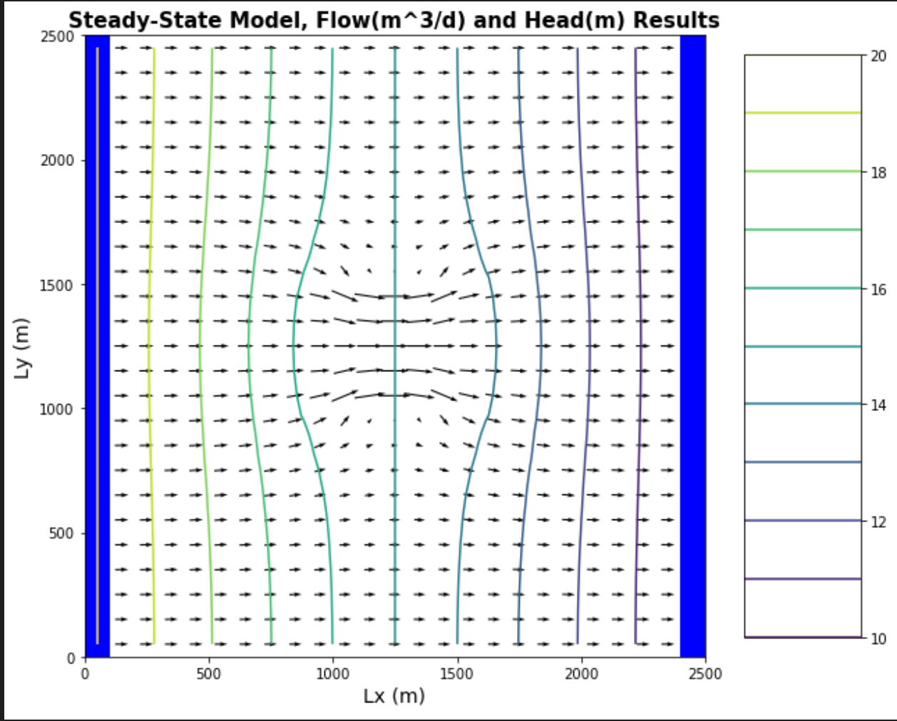

## Quinn Hull
## The Challenge 3

## The Figures
1. *Figure 1: Base case boundary fluxes.*

2. *Figure 2: Base case boundary fluxes and flux through midline of domain.*

3. *Figure 3: Comparing 2D Keq with the area-weighted harmonic mean K.*

4. *Figure 4: Comparing 2D Keq with the area-weighted arithmetic mean K.*

## The Challenge
1. For the initial values of background and inclusion K, plot the flow into the left and out of the right boundary. (The code, as provided, makes this plot for you.) Explain why the values are not constant along the boundary (relate to the definition of a Type I boundary). Explain why the flow distributions are the same for the left and right boundaries.
> * See Figure 1 for right / left boundary profile of Q. Recall that these boundaries are 'constant head' (type 1) boundaries. This is also a steady-state system, which implies that discharge in = discharge out. The steady-state assumption checks out: if we sum the values of 'Q' along each boundary, they are equal (we can check the .LIS file directly for information about storage at the boundaries, too).
> * From the perspective of Type 1 (constant head) boundaries, it makes sense that there might be a 'shape', or distribution, of Q values along each boundary. Constant head boundaries don't imply constant discharge, so long as the head remains constant along them (they do!)
> * From the perspective of intuition, it seems to me that the 'right' (lower head) boundary is a little like groundwater flow into a surface water body (like a lake). The lake level is (basically) at a constant head, and yet flux is almost certainly not the same at all locations along this boundary. This is fundamentally a function of the lake geometry, but on a secondary level related to the inevitable heterogeneities in aquifer materials that force water to take longer and/or slower flow-paths on their way into the lake. Where groundwater flow is 'slowed' down (or in 2-D taking longer flow paths), flux will be lower. I think that's exactly what's going on here.
> * The flow distributions are identical not out of necessity but out of an accident of geometry. The low-K inclusion is an equal distance from each of the two boundaries. If we move it (for example) closer to the right (outflow) boundary and laterally towards one of the vertical noflow boundaries then we get the figure below:

2. Add a plot of the left-to-right flow along a line that passes through the center of the inclusion. What can you learn from comparing this distribution to that seen on the boundaries?
> * See Figure 2 for right / left boundary profile and a 1-D slice through the center of the model domain. This 'center' or 'middle' slice tells a very different story of Q, in that it has the highest magnitude around the low-K inclusion, and (precipitously) the smallest magnitude within the low-K inclusion.
> * In comparing this to the 'L' and 'R' boundary observations, we observe that the lowest 'Q' at the boundaries corresponds with the 'Y' location of the low-K inclusion. This fits our conceptual model of flow 'slowing down' through the low-K inclusion. Of course, the drop is much larger in the inclusion itself.
> * It's really interesting that flow in the middle slice is greatest just at the boundaries of the low-K inclusion. I feel like this is something akin to putting a larger boulder in a river. When the river water encounters the boulder, it obviously cannot flow through it and so it is shunted to the sides. Given that the river channel geometry doesn't change, the only way to 'accommodate' this redirection of flow is for the discharge itself at these locations around the boulder to increase. Once the flow has passed the boulder, it then flows fast to fill the space behind it. Here the low-K inclusion is our boulder, and the groundwater flow is our river.

3. Calculate the total flow into (and out of) the domain. Use this to calculate the Keq of the heterogeneous system with the K values as given in the starter code. Repeat this calculation for the following K values for the inclusion (keeping the background K as it is given): 0.01, 0.1, 1, 10, 100. Compare the Keq to the harmonic and arithmetic mean K values based on the area occupied by each medium (rather than the length for a 1D system). Can you draw any general conclusions about the impact of high or low K heterogeneities on the equivalent K for the flow system examined?
> * See Figure 3 and 4 for relationship between K_eq, K_arithmetic, and K_geometric. Both volumetric Flow (big Q) and 1-D flux (little q) increas monotonically with increasing hydraulic conductivity in the inclusion.

  > | Q_0.01 = 94.87048 | Q_0.1 = 96.64535 | Q_1 = 104.16667 | Q_10 = 111.683235 | Q_100 = 113.3824 |

  > | q_0.01 = 0.003794 | q_0.1 = 0.003865 | q_1 = 0.0041666 | q_10 = 0.0044673  | q_100 = 0.00453529 |

  > * In general the Keq is relatively insensitive to what happens in that 5x5 inclusion. I.E. although we vary the K of the inclusion over 5 orders of magnitude (0.01 to 100), the Keq only ranges between ~0.9 to ~1. This value is approximately that of the primary aquifer material (K=1). Conceptually, this checks out - flow generally avoids the low-K intrusion, seeking out faster and longer flow paths instead.
  > * By comparison, flow-blind calculations of hydraulic conductivity that use only the geometry of the K field like arithmetic and geometric averaging tend to give false approximations of Keq, especially when the K of the inclusion is particularly large or small.  

4. Does the equipotential distribution depend on the absolute or relative K values for the background and the inclusion? How would you use the model to test your answer?
> * The head contours are definitely dependent on the K values of the inclusion. For example, check out the head contours if (1) K_inclusion = 100 and K_inclusion = K_background = 1.
> * You could further mess around with this by changing the K_inclusion and K_background values.
> ***I feel like I am missing something important about this question**

**K_inclusion = 100**

**K_inclusion = 1**

