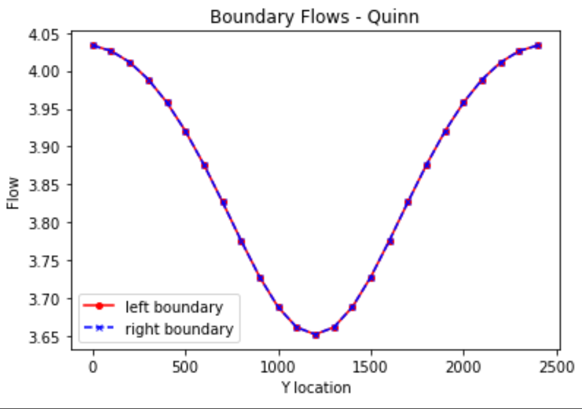
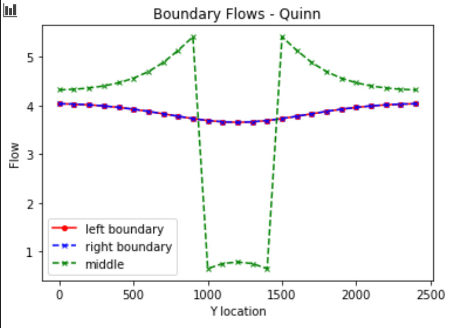
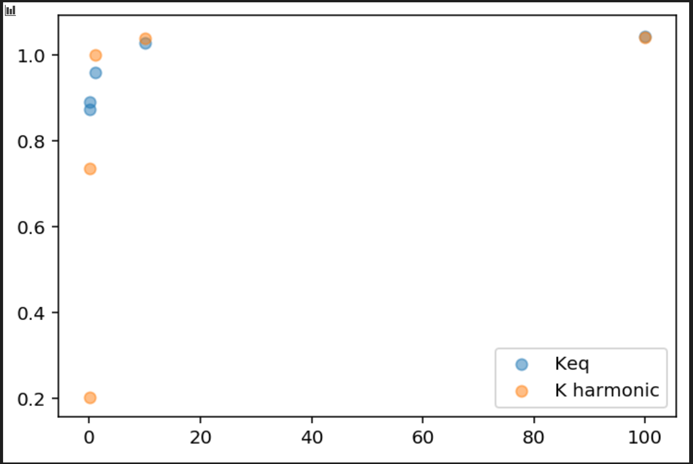

## **NOTE** Although I use this repo for working, submissions should be to the new repo
## The Figures
1. *Figure 1: Base case boundary fluxes.*

2. *Figure 2: Base case boundary fluxes and flux through midline of domain.*

3. *Figure 3: Comparing 2D Keq with the area-weighted harmonic mean K.*

4. *Figure 4: Comparing 2D Keq with the area-weighted arithmetic mean K.*

