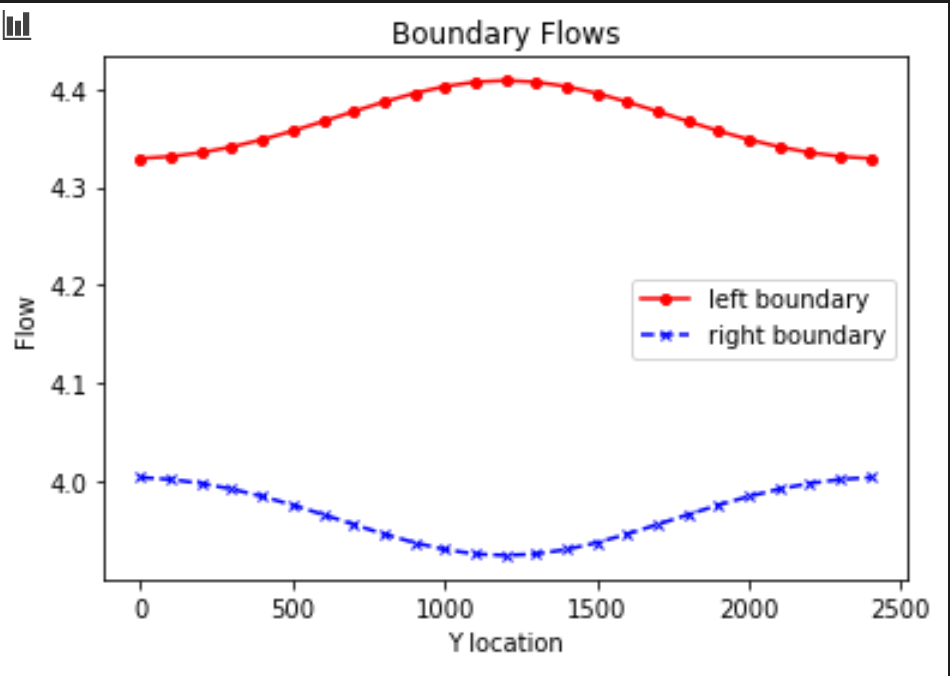
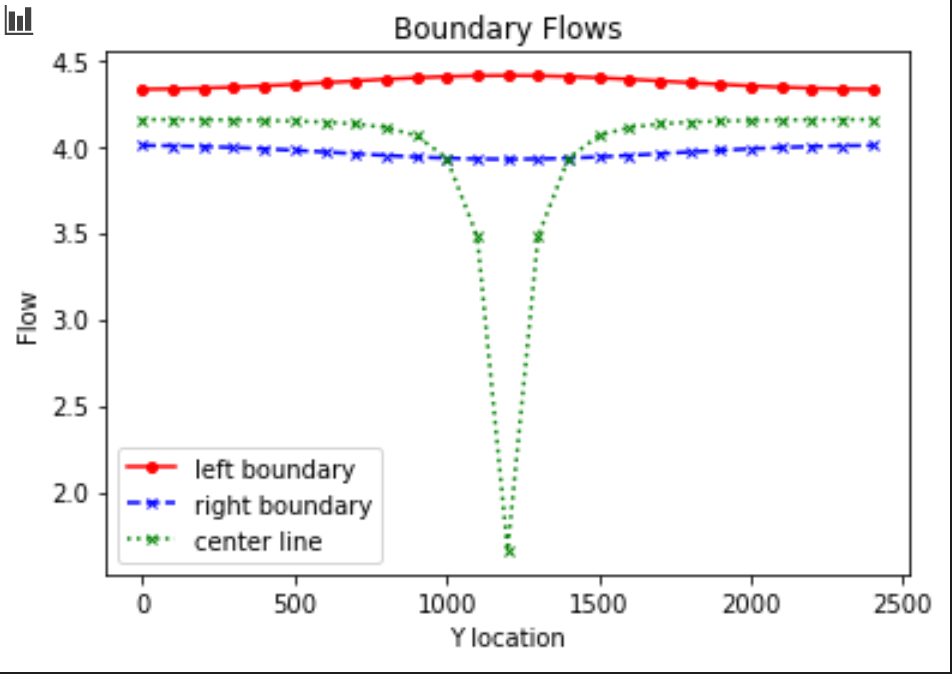
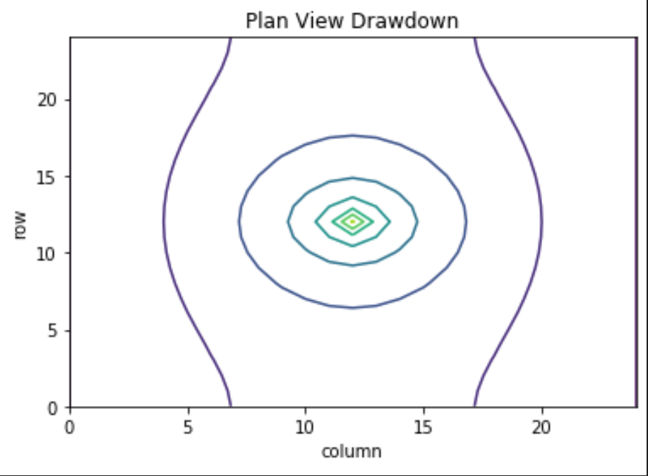

### The Figures:
1. *Figure 1: Base case boundary flows .*

2. *Figure 2: Base case boundary fluxes and flux through midline of domain.*

3. *Figure 3: Base case equipotentials and flow vectors.*

4. *Figure 4: Base case drawdown around centered well - simply python plot.*

