### The Figures:
1. *Figure 1: Base case boundary flows .*
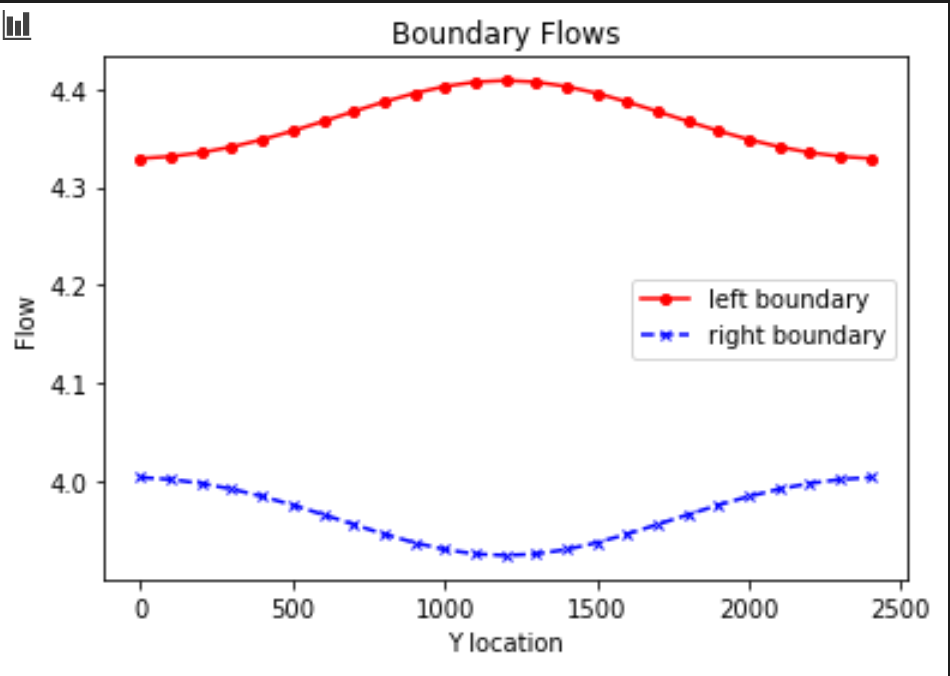

2. *Figure 2: Base case boundary fluxes and flux through midline of domain.*
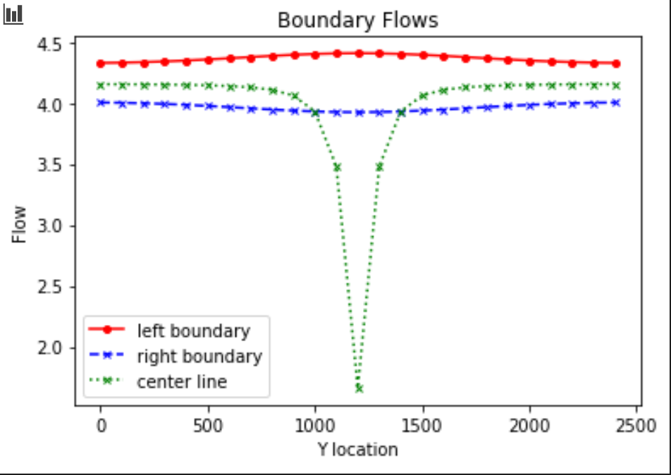

3. *Figure 3: Base case equipotentials and flow vectors.*
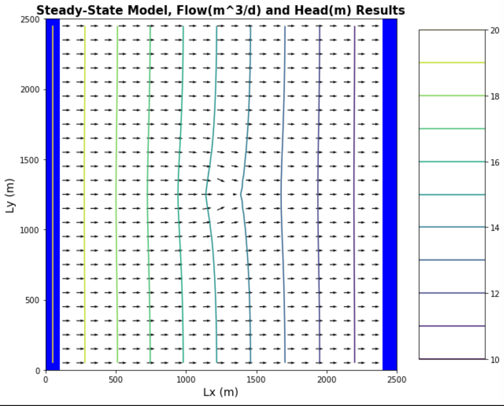

4. *Figure 4: Base case drawdown around centered well - simply python plot.*
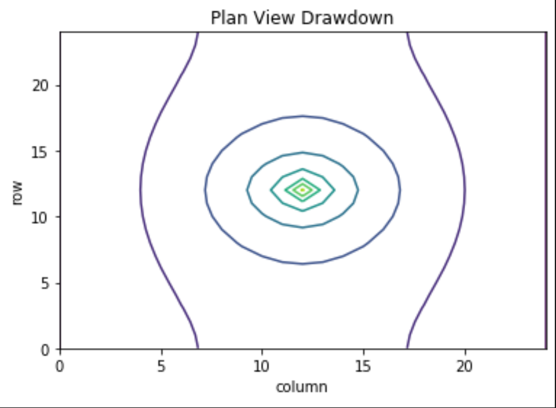

### The Challenge:
1. For the initial well location, plot the flow into the left (constant head = 20) and out of the right (contant head = 10) boundaries. (The code, as provided, makes this plot for you.) Explain why the values are not constant along the boundary (relate to the definition of a Type I boundary). Explain the shapes of the flow distributions and why they are not the same for the left (inflow) and right (outflow) boundaries.
> * Boundary flows from initial well location (a [0,10,15])

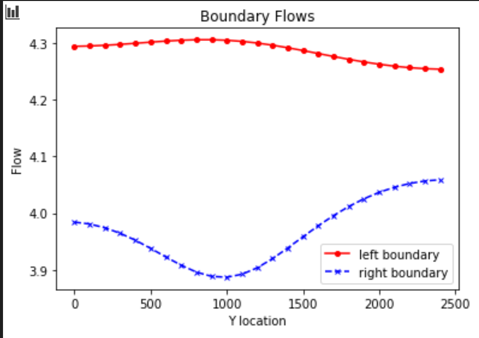

> * The lines are not constant along each boundary because they are Type I (constant head boundaries). Thus by definition the head (not the flux along the boundary) are held constant in space. The shapes of the flux distributions are a function of the location and pumping rate of the well.
> * The shapes appear 'lopsided' (not centered) because the well is not located in the center of the domain (as in the first 'Correct' figure). But they are in principle different in shape because the well removes water from the domain. Specifically, the well 'pulls' flow from the part of the left (upper) boundary and 'dampens' flow from the part of the right (lower) boundary that it is closest too in Y-space (centered on Y=1000). These flow asymmetries can be thought of as reflections of the 'area of influence' of the well (I think)

**Additional Reflections, 2nd Submission**
> * One thing we discussed in class was that the flow distribution is also a function of distance from the well. Although  boundaries are linear  flow is pulled radially towards the well, so distance is minimized radially. At this minimum radial distance, flow will be maximized along the boundary. If the boundary were circular in shape, located at the same radial distance from the well, we would actually see constant flow at every location.

2. Add a series of the left-to-right flow along a line that passes through the center of the well [:,12]. How do you interpret the flow along this transect? Hint, also look at the flow along a transect just upgradient from the well [:,11].

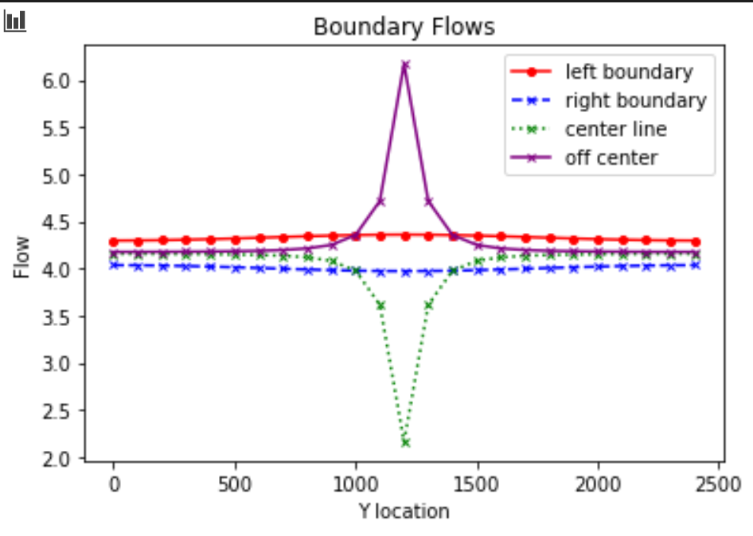
> * This is really cool figure. The center (green) line shows flow decreasing through the center 'y' point. The off-center (purple) line shows the flow increasing through the center 'y' point. They are almost mirror images of each other.

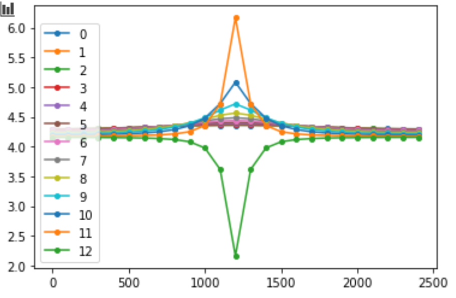
> * The above related figure shows how flow increases in magnitude as we get closer to the well in Y-Space.
> * I believe lines 0-11 are a function of energy, conservation of mass, and physics already described by Theis. I'm not exactly sure how best to describe it. The gradient of the piezometric surface is steepest nearest the pumping well because the 'ellipses' of drawdown surrounding the well are smaller in area than at locations further way from the well. So a constant pumping rate from the well results in higher flow rate in these areas close to the well in order for mass to be conserved. Theis said it better, I bet.
> * I'm not so sure how to interpret line 12, but I guess it has something to do with mass flux of water removed from the domain by pumping.
> * Note I think I would benefit from talking about how to interpret drawdown and head for this question.

**Additional Reflections, 2nd Submission**
> * Another important observation that came out of our discussion is that because flow remains positive, even just past the well (line 12), we are never reversing the direction of flow. Flow is always going from left to right. In fact, we can think of line '12' as a similar to the right boundary in that it represents the effect of pumping 'removing' water from the domain. The effect is more exaggerated at line 12 than at the right boundary bbecause it is closer to the well.
> * It's interesting to me that we can take the integral of the space between any two transects of 'Q' to calculate the flow rate (vol/time) of water removed from the well. That definitely hadn't occurred to me!

3. Then, look at the plot of equipotentials and flow vectors. Describe how water flows through the domain. To aid in your description, draw a line through all of the flow vectors that terminate in the well. This approximates the capture zone of the well. Use this to refine your description of the flow system, being as specific as possible about where water that ends up being extracted by the well originates on the inflow boundary.

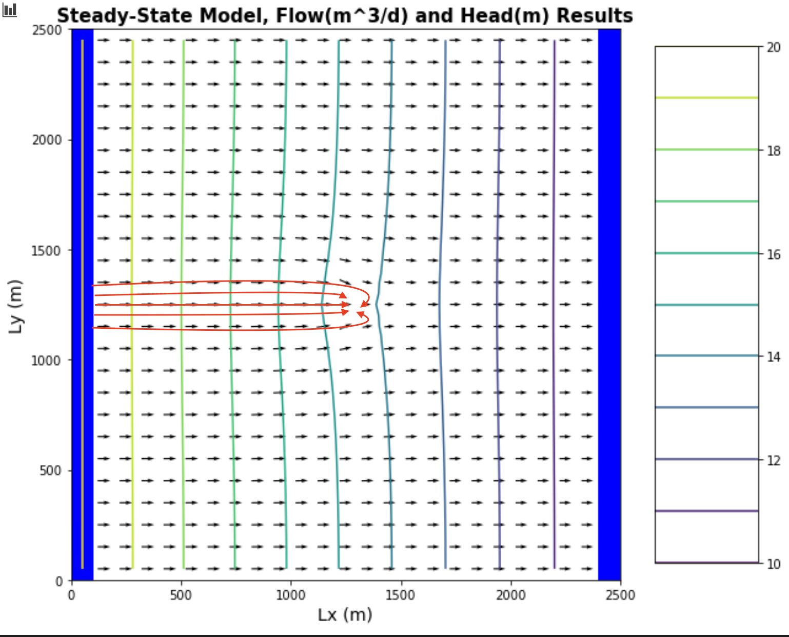

> * It might be a bit bigger than this actually...
> * Most flow paths in the domain are affected in some way by pumping in the well, however only a very narrow band of flow originating at the left boundary is captured by the well (Y ~ 1100-1400)

**Additional Reflections, 2nd Submission**
> * I think I need to revise this figure to make the catchment zone a little bit smaller, becuase I don't think we ever see 'negative' Q' (flow moving from right to left). The way I've drawn this misrepresents that reality.

4. Then, look at the plan view drawdown plot. Why aren't the drawdown contours circles? Either explain why this is correct, or fix the plot.
> * See figure 4. The drawdown contours are not circles because there are no flow boundaries to the top and bottom.

**Additional Reflections, 2nd Submission**
> * We talked a bit more about this in class today. The drawdown contours are circles - correctly represented as such - because pumping in effect stretches the gradient towards the no flow boundary, and compresses the gradient toward the constant head boundaries. We can think of this in terms of having an image pumping well that is 'removing' water from the domain at the constant head boundaries, and an image injection well that is 'adding' water (such that flow is constant at 0 along these no flow boundaries).
> * It is worth noting that the contours should be elliptical, not diamond shape, but appear to be that shape near the pumping well due to the resolution of the model being too coarse.
> * Finally, it is important to scale the axes correctly, as a geometric interpretation isn't really possible without doing that!
> * Head contours are perpendicular to the no flow boundaries, and as a result flow is parallel to it along the boundaries.

5. Move the well to [0,5,5]. Use all plots necessary to describe fully how water is flowing through the domain with the well in this location. Be sure to include the drawdown plot in your discussion - compare this plot to the equipotentials and flow vectors. Something is not right about how the well location is shown. Fix it and explain what was wrong!!

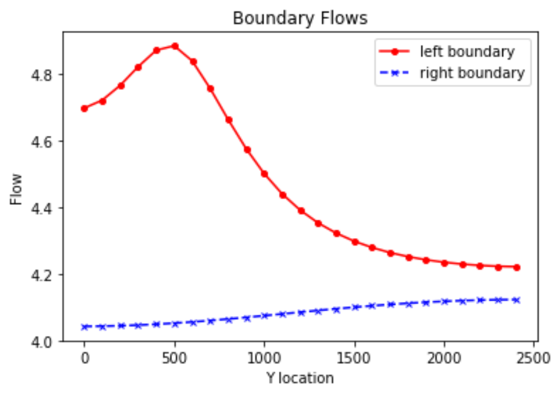
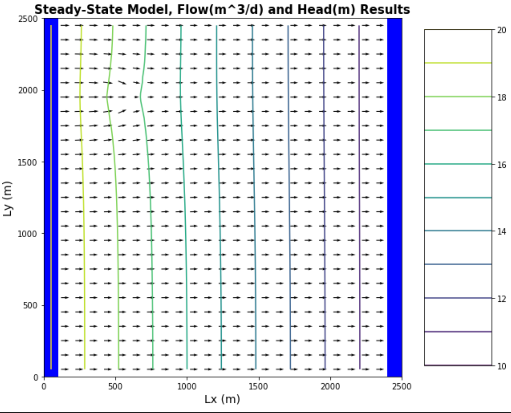
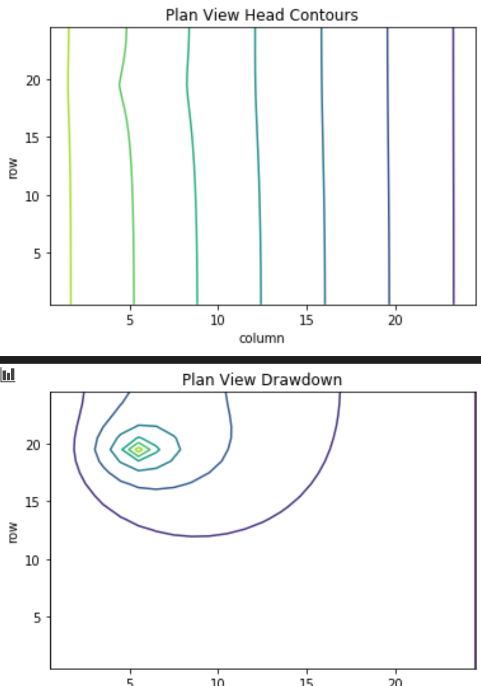

> * Here the same principles apply as described above. Flow magnitudes along the left boundary are much higher in Y-space close to the well location. The drawdown is not only asymmetrical but also a-elliptical because of the closeness to the no-flow boundary above. So constant heads perpendicular to that plane, which vibes with our head contours.
> * I think I would benefit from thinking about noflow boundaries conceptually
> * The error was in the plots titled 'Plan View Head Contours' and 'Plan View Drawdown'. I fixed this just by resetting the origin in the matplotlib function, but that's really a bandaid. It seems like the indexing along the y axis was flipped.

**Additional Reflections, 2nd Submission**
> * The professor asked to include a plot showing the flow if no pumping.

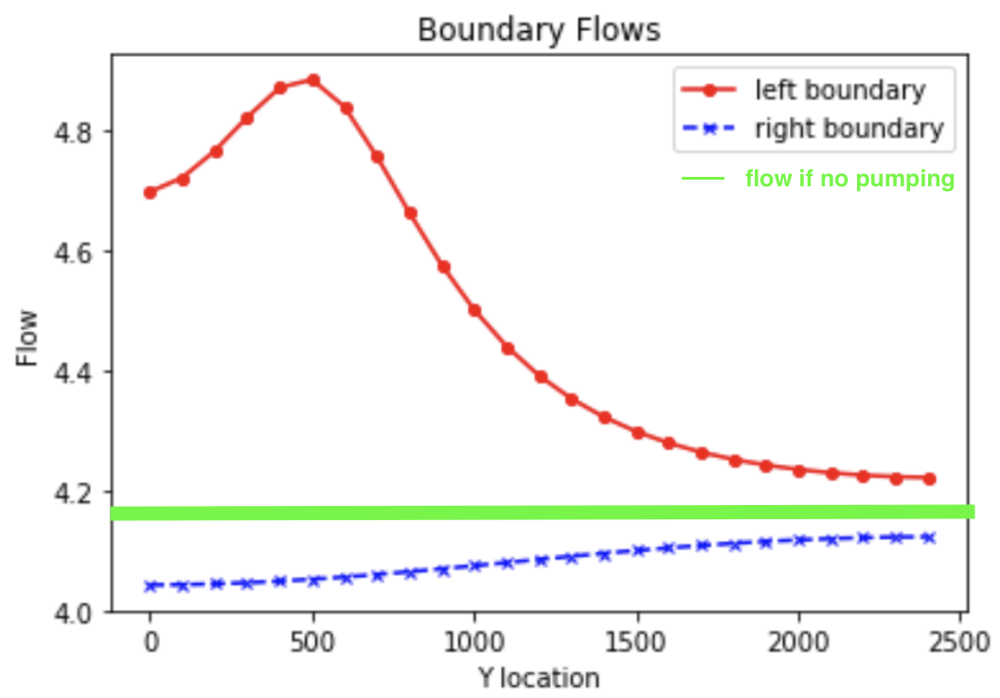

> * It seems that flow at the left boundary deviates more from this center line than the right boundary. Qualitatively, I think the magnitude of deviation represents the relative effect of pumping at that location. In a way, deviation from this line may be a way to 'map' the area of influence of a pumping well. I'm not sure what the sum of the area between the boundary flow lines and green line may represent. It feels like something to do with a 'percent' contribution to discharge from the pumping well (as the sum of these two areas will equal 100% of the total flow coming out of the well). But I'm not sure what that really means. 
