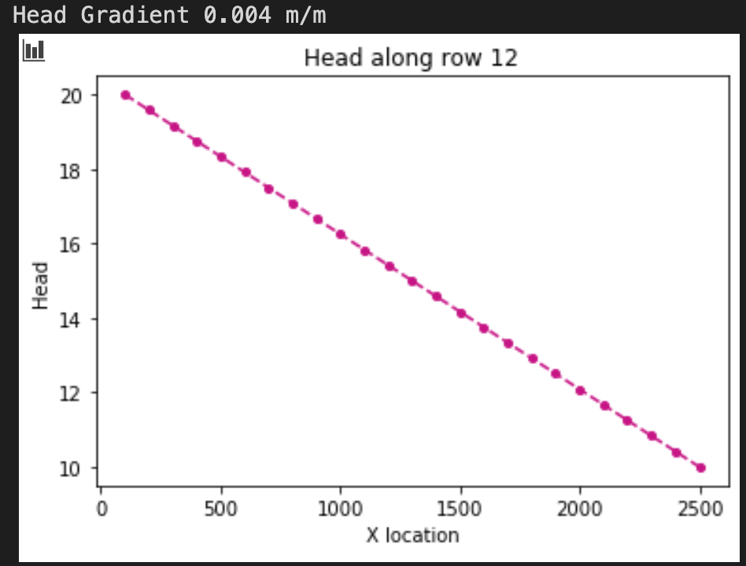
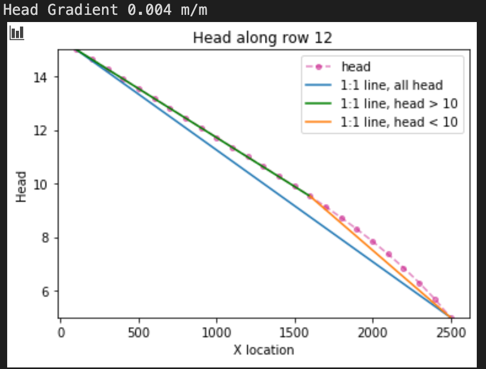
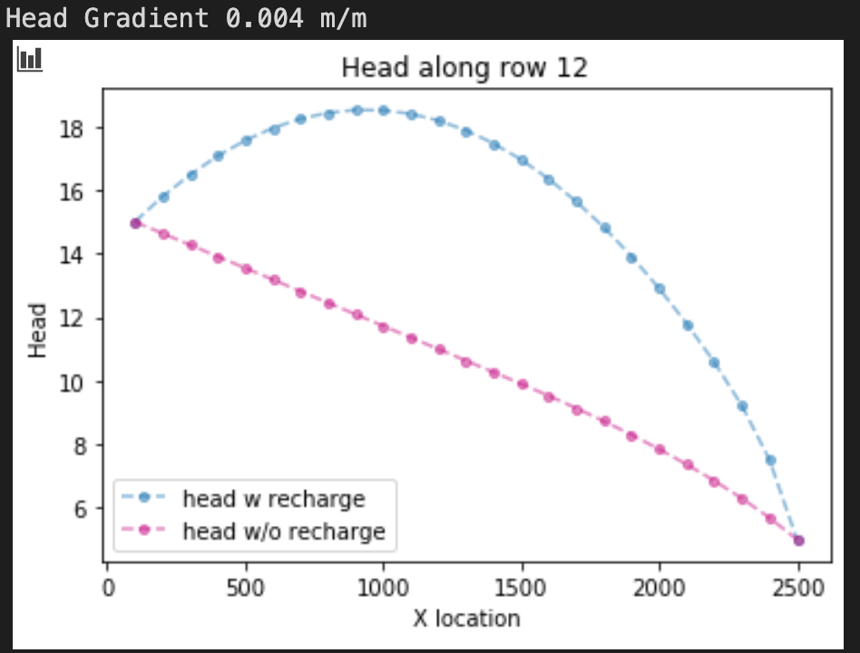
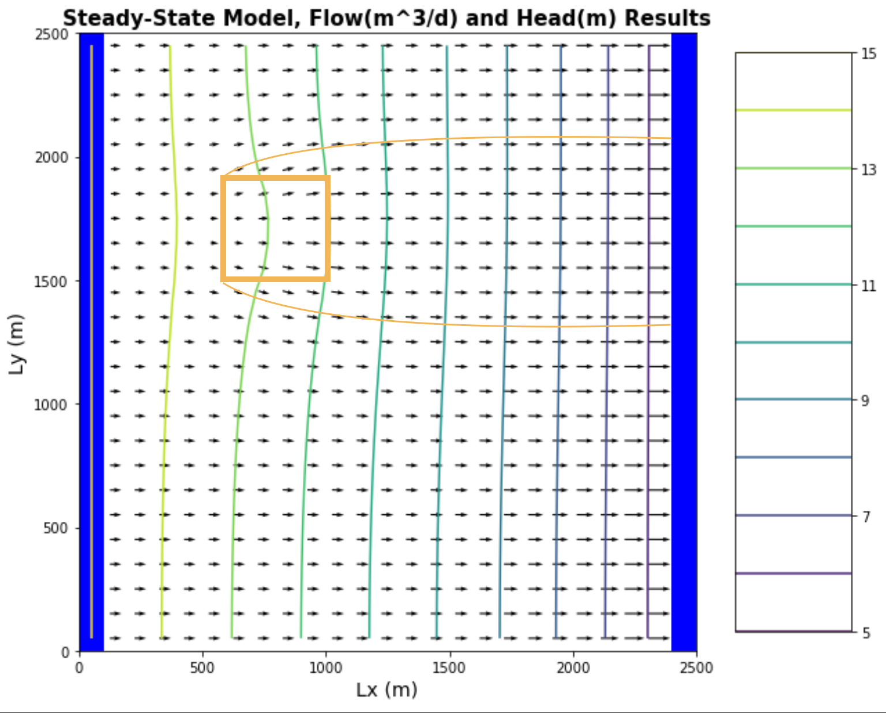
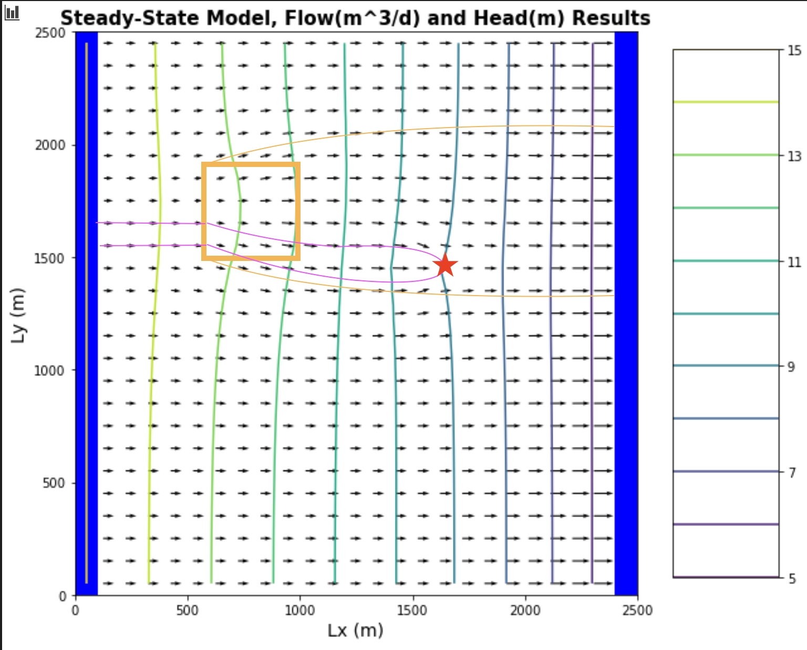
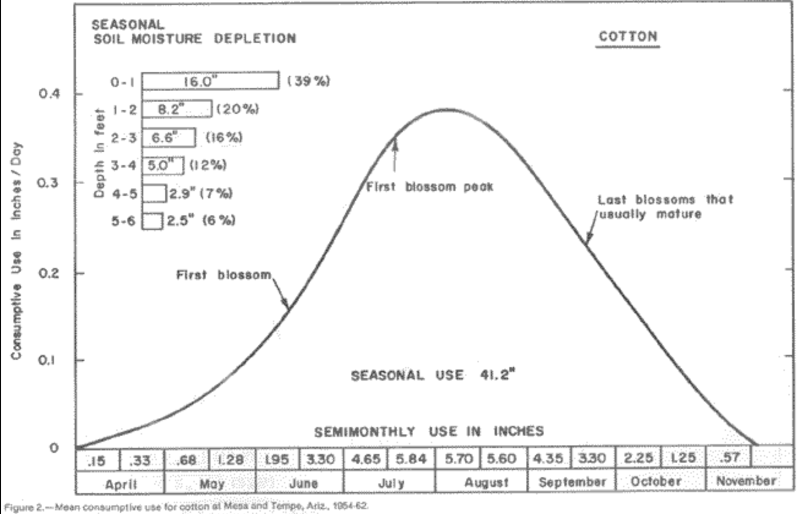

* Quinn
* HW 05
* 02/15/2021

### The figures
**Figure 1.1: Head Gradient with boundary conditions 20 and 10**

**Figure 1.2: Head Gradient with boundary conditions 15 and 5**

**Figure 2.1: Head Gradient with boundary condition 15 and 5, plus recharge**

**Figure 3.1: Head Contours and Flow Lines with respect to irrigation location at 6:10, 6:10**

**Figure 4.1: Head Contours and Flow LInes with respect to irrigation at location 6:10, 6:10 and pumping well at 5, 10**

### The Challenge
1. For the initial boundary head values and pumping and recharge rates, compare the head versus x distance - along a transect from the middle of one constant head boundary to the other - to the results for the BoxModel.  Now reduce the boundary heads to 15 and 5.  Compare this result and explain any observed differences.  The overall gradient is the same, as is the K of the medium ... is the flow the same for both boundary conditions?  Why or why not?

    * Results: See Figure 1.1 and 1.2
    * **Fig 1.1** (with boundaries of 20 and 10 respectively) shows a completely linear function of H(x). **Fig 1.2** (with boundaries of 15 and 05 respectively) shows a linear function of H(x) for heads > 10 (where saturated thickness is constant), and exponentially decreasing function of H(x) for heads < 10 (where saturated thickness is decreasing). Because transmissivity is constant with distance along x for the confined situation, (bxK), head is a linear function with distance along a flowpath. In the unconfined situation, transmissivity is not constant with distant along x, because the water head < depth of aquifer unit. As such, head is not a linear function with distance along flow. *Note that 10 is an important number because it is the cell, and thus domain, thickness*
    * Fact: `k` is proprotional to `T` everywhere in the study domain for both confined and unconfined conditions.
    * Fact: `T` is constant everywhere in the domain for the confined condition need because the saturated thickness `b` is constant.
    * Fact: `T` is variable in the domain for the unconfined location because `b` is variable (i.e. when head `H` < cell thickness 10).
    * Fact: Because MODFLOW cannot explicitly model the coupled processes of variable aquifer thickness in a model 1 cell thick, it approximates decreases in `T` in an unconfined situation by reducing the `K` for a given cell proportional to the change in `T`. (as per lecture)
    * Claim: In order for flux to be conserved along a flow path (ala steady state), it must be true that the hydraulic gradient in the unconfined condition will appear to behave like a reduction in `K`. Aka, as the aquifer thickness `b` gets smaller towards the right boundary, the hydraulic gradient will get steeper.
    * Claim: For steady state confined flow,  `f(x) = q = k(b) * dH/dx` where `k(b)` is a constant. For steady state unconfined flow, `k(b)` is a constantly changing along the flow path.
    * Question: I don't think this formulation capture quite accurately the physics of this question. This explanation doesn't quite make sense in terms of a multi-cell-thick domain.

2. Now add recharge at a constant rate of 1e-4 m/day over the entire top boundary.  Explain the head transect and boundary flows.  Is flow in this system 2D or 3D?  Is it represented as 2D or 3D?  Explain what you mean by your answers.

    * Results: See Figure 2.1
    * **Figure 2.1** shows that when a constant recharge rate is applied over the entire top boundary, it creates a concave down function terminating at the boundary conditions. It's interesting to note that the highest head in this regime is no longer the left boundary, but instead a vertical line extending through x ~ 800 where the hydraulic head is highest. This functions as a kind of groundwater divide in which flow to the left of this line flows towards the left boundary, and flow towards the right flows towards the right boundary.
    * Claim: The model represents flow in three dimensions (x, y and z). But there cannot be vertical flow because the domain thickness is just 1 cell. This means that flow in the system by definition can only be 1D or 2D. However, if we interrogate the head contours in plan view, we find them to be parallel and hence flow direction can be expressed only in terms of 1 dimension - distance along the x axis. So I would say **flow here is 1 Dimensional, while the model is 3 Dimensional.**
    * Question: What is *exactly* is meant by the binary between flow 'in the system' and flow 'represented' in this question?

3. Now model a system with zero recharge except for a farm located in [6:10, 6:10] - in python terms.  Recharge beneath the farm is 1e-4 m/day due to excess irrigation.  First, calculate the annual excess irrigation, in meters, that has been applied to the farm.  Second, assuming that the crop is cotton, it is located in southern Arizona, and cotton is grown all year (for simplicity), calculate the total irrigation rate on the farm that would be associated with this amount of excess irrigation.  Finally, identify the area within the domain that might be subject to contamination if the recharge water was somehow tainted.

    * Results: See Figure 3.1
    * **Figure 3.1** shows irrigation applied over a small 160000 m farm
    * Fact: Excess Irrigation Rate = Recharge Rate
    * Claim: Annual Excess Irrigation = `recharge [m/day] x num cells [unitless] x area [m^2] x annaul period [day/yr]` = 0.0001 x 16 x 100^2 x 365 = **5840 [m^3]**
    * Claim: As per a ***heated*** discussion about the way to think about the total irrigation rate, this question requires thinking critically about what the recharge rate means. I interpret `total irrigation rate = recharge [excess] rate + cotton consumptive use rate`.
    * Research: I consulted an old consumptive use graph of cotton available here (https://cals.arizona.edu/crops/irrigation/consumuse/cottoncu.gif) to make my estimates. 
    * Claim 1: I found after summing over all months that the annual consumptive use rate of cotton is actually **0.07 m/d** concentrated into the growing season between April and May (`np.array([0.15, 0.33, 0.68, 1.28, 1.95, 3.30, 4.65, 5.84, 5.70, 5.60, 4.35, 3.30, 2.25, 1.25, 0.57]).mean()/12/3.28`).
    * Claim 2: Using this logic `total irrigation rate ~ cotton consumptive use rate ~ 0.07 m/day` and recharge (`0.0001 m/d`) is basically a rounding error.

4. Lastly, start the well pumping at a rate of 8 m3/day.  Using one color, identify the capture zone of the well.  Using a second color, show the area that might be contaminated by the irrigated farm fields.  Comment on the impact of the well on the pattern of potential contamination.  
 
  * Results: See Figure 4.1
  * Comments: **Figure 4.1** really shows us that the capture zone of the well includes the area irrigation-driven recharge zone. This means that any water pumped out of the well will inevitably be drawn from this irrigation zone. This is potentially an issue for users if this irrigated water is contaminated with pesticides or nutrients.
