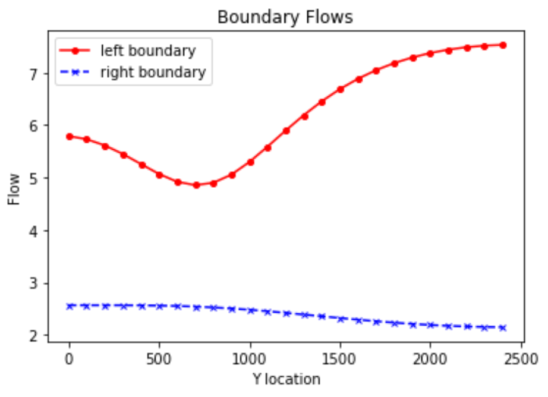
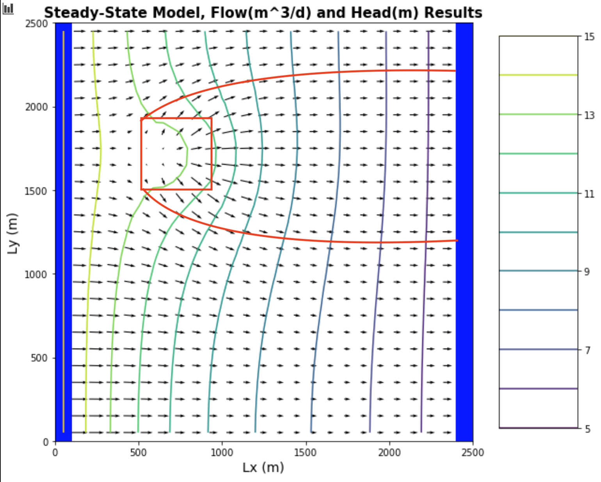
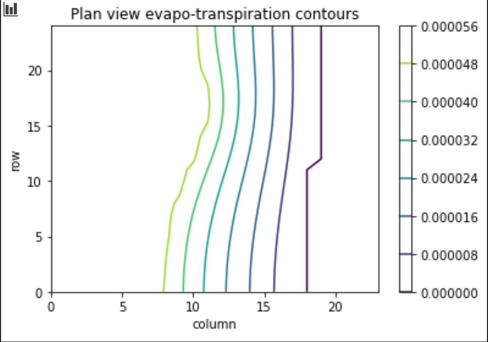
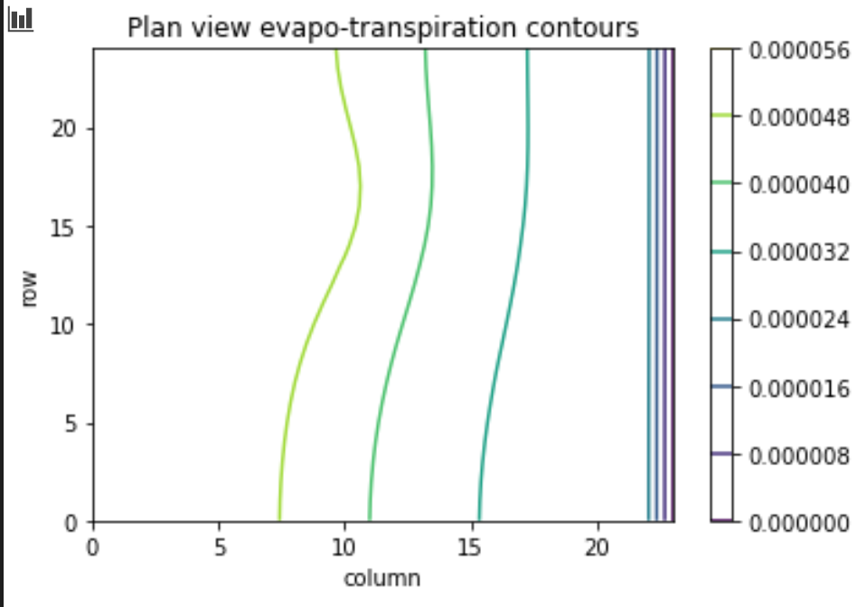
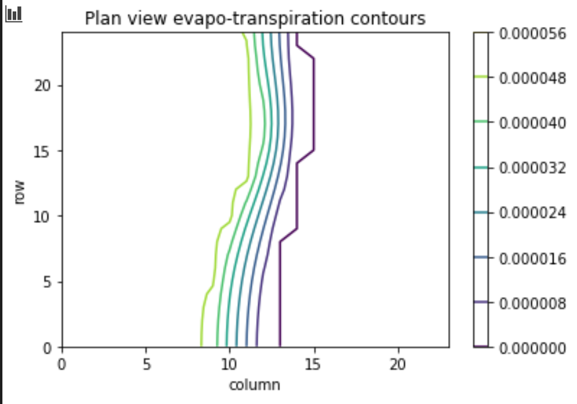
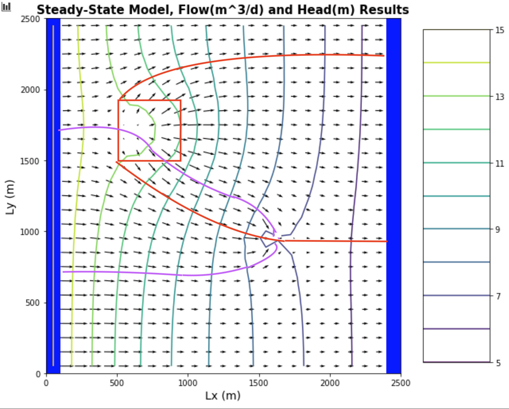
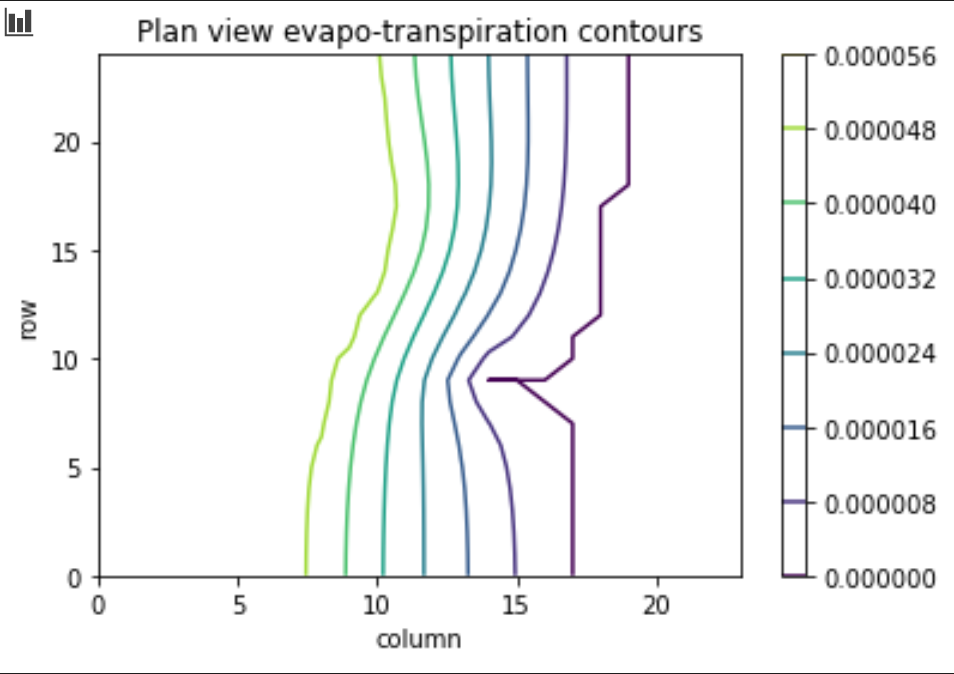
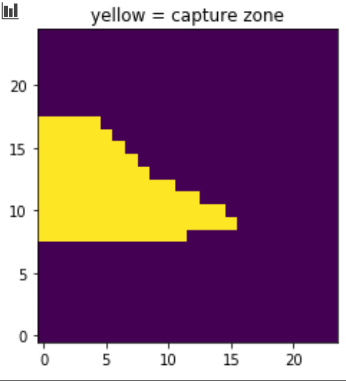

* Quinn Hull
* HW 6
* Transpired

**Clarifying Question** I'm starting to get confused as to which ones of the graphs have their axes reversed. Can we set that straight as a class?s

## The Challenge
### a. For the initial boundary head values and recharge and ET rates, establish the flow across the boundary versus y-distance along the left (15 m) and right (5 m) boundaries.  Plot the equipotentials and flow vectors in plan view and outline (hand draw) the area that would be affected by recharge (i.e. if it were contaminated).  Also show a contour plot of the steady state ET flux in plan view.

**Figure 5.1.1** *A plot of flow vs y distance along the left and right boundaries where the aquifer is unconfined, flow recharges the agricultural region `6:10,6:10` at `5e^-4 m/d`, ET occurs over the entire domain at `5e^-5 m/d` to an extinction depth of 3 meters, and boundaries are at `15` and `5` respectively*

**Figure 5.1.2** *A plan view of equipotential lines showing area influenced by recharge from agricultural region*

**Figure 5.1.3** *A contour plot of the steady state ET flux in plan view*

### b. Change the extinction depth.  What impacts does this have?

**Figure 5.2.1** *A contour plot of the steady state ET flux in plan view given an extinction depth of **10***

**Figure 5.2.2** *A contour plot of the steady state ET flux in plan view given an extinction depth of **1***

> The contour maps **5.2.1** and **5.2.2** show that with a shallower extinction depth, the contour lines of ET are much closer together, whereas with deeper extinction depth, the contour lines of ET are much further apart.

> If `H = 10` (cell depth), then all values of `h > H` (head greater than cell depth) will have full evapotranspiration `ET = 5e-5`. However, for all heads `h < H`, we will have `ET < 5e-5` decreasing to `ET = 0` for all `H - h < ED`, where ED is the extinction depth. We see this pattern in all of our evapotranspiration contour plots, namely 'full ET' on the left side of the domain where heads `h` are greater than the cell depth `H`. And somewhat decreasing ET < full ET on the right side of the domain where heads `h` are lower.

> Following up on the previous, ET is represented like a linear function, `ET(h) = m*h`, where at `h0 = 10`, `ET` is the full evapotranspiration rate. At `h1 = h0 - ED` (all heads below the extinction depth), `ET` is an evapotranspiration = 0. So in my plots what has happened is that this simple function is applied for different extinction depths, and what ends up changing in the function `ET(h)` is the slope `m`. A steeper slope will occur for shallower extinction depths because the transition from full ET to 0 ET must be more rapid; a shallower slope will occur for deeper extinction depths. This is why we see the contour line spacing that we do.

### c. Explain, conceptually, how MODFLOW is representing ET.  How does this compare to your intuitive understanding of ET in the real world?

> One thing that is worth noting is that although ET is a linear function, it is not a linear process. Namely, at each cell *ET(hi,j)*, *hi,j* is itself a function of *hi-1,j-1*, *hi+1,j+1*, etc... I.e it is a function of its neighbors. I think that modflow (which by definition iteratively solves for h using a finite difference method) handles this, but I wanted to bring it up because it links to your point about **what is linear?** and I want to check my understanding.

> However, the assumption of a linear function (ET(h) = m*h) describing ET is problematic because as we know *where* and *to what depth* ET occurs is highly dependent on climate, vegetation, depth to water, and other factors. This function doesn't well describe ET from taproot organisms, as you mentioned in class. So we could call it an approximation.

> One thing I am trying to understand is how this model factors in ET for `h > H`, namely the heads in the 'confined', left-side portion of the domain. Here we see full evapotranspiration, and so it would kind of be like having a fully confined aquifer right at the land surface, which for some reason just feels physically unrealistic to me.

> I also imagine that there is some sort of approximation going on in the background similar to what we saw with approximating changes in transmissivity `T` for decreases in `b` by decreasing `K` in an earlier exercise. I'm not sure how that would happen though.

### d. Now start the well pumping, extracting 20 m3/day.  How does the well change the zone that is affected by the recharge area?  How does it affect the ET map?  Write a mass balance for the well - how much water is coming from a boundary?  How much is originating as recharge?  How do you account for the impact of ET on this mass balance?  At steady state, what are the effects of 'capture' by the well?

**Figure 5.4.1** *A plan view of equipotential lines showing area influenced by recharge from agricultural region and pumping from the well*

**Figure 5.4.2** *A contour plot of the steady state ET flux in plan view influenced by recharge from agricultural region and pumping from the well*

> **Figure 5.4.1** shows us that the addition of pumping increases the size of the 'impact' zone of agriculture recharge (red) relative to the no pumping situation. **Figure 5.4.2** shows the evapotranspiration contours with a pumping well, with the primary impact being that we see less ET around the pumping area. This makes sense because pumping causes the heads in that area to be lower, effectively extinguishing the impact of ET.

> Returning to **5.4.1**, it's fascinating to compare the size of the 'capture' zone of the well in this figure to that of the 'capture' zone in the previous exercise (Recharge Me) where we didn't have any ET. (There were also some other differences, I now see, including the pumping rate and well location!) The capture zone is much larger here, extending a long way along the upgradient, left-most boundary.

> Computing the mass balance is tricky because we now have multiple 'sinks' in the system - the pumping well, and ET. We also need to ask, 'which mass'? If we are talking just discharge, then I think it is easier than trying to calculate the concentration of a contaminant.

> Mass Balance: `Qin = Qrecharge + Qboundary`, `Qout = Qpump + QET`, `Qin = Qout`
>   * `Qboundary` = flux_vals[(25-17):(25-7),0].sum() ~ `60 m^3/d`
>   * `Qrecharge` = 0.25 * (rech_zone[6:10,6:10]*100**2).sum() ~ `20 m^3/d` (because it looks like about a quarter of the recharge area contributes to the well capture zone)
>   * `Qpump = 20 m^3/d`
>   * `QET` seems tricky to capture (by itself). But for the sake of argument we use two appraoches. The first is to calculate it indirectly as an unknown(using the mass balance); the second is to calculate it using a mask in python.
>     1. `Qrecharge + Qboundary = Qpump + QET`; `20 + 60 = 20 + QET`, so `QET ~ 40 m^3/day`
>     2. `(et_mask*et_out).sum()` -> `QET ~ 45 m^3/day`

> It's pretty cool that we get similar numbers for ET from both approaches
