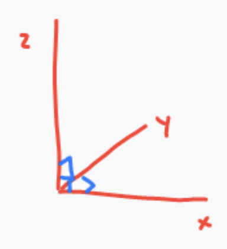

* Quinn Hull
* 02/25/2021 - Updated 02/26/2021
* Exam Followup on Model Dimensionality

### 1. Model and Parameter Dimensionality
> The rationale for having 3 dimensions of space (x,y,z), as opposed to - for example - four or ten, is that the three dimensions are completely independent. If we move along the x axis, we induce no movement along either the y or z axes. In turn, these dimensions fully capture the range of possible movements in space.

> Defining model dimensionality of < 3 requires 'reducing' space to its principal component(s). For example, if the movement of flow can be expressed fully (or mostly) by movement along only the x, y, or z dimension, we can get away with a 1D model. For example, flow in a vertical column packed with 'homogenous' material is nearly entirely along the z axis. Sure, there might be 'local heterogeneity' that creates areas of non-vertical flow, but this variation is far less important than that over the z-axis. So we can ignore it. Ignoring 'non-principal' dimensions is nice because it yields computational savings and is a safe-guard against adding unnecessary complexity that can challenge our interpretation of model results.

> Just as we have dimensionality in physical space, we can also define dimensionality in parameter space. Ideally, our model parameters are independent (or orthogonal) to one another, just like the x, y, and z dimensions in physical space. In reality, however, they often are correlated to one another, both as a function of space and process.
>   * One example: hydraulic conductivity in one location is often highly related to hydraulic conductivity in an adjacent location (due to geologic processes underlying lateral continuity). So instead of defining K for each cell, we lump K together into blocks and layers.
>   * Another example: porosity `n` and permeability `k` are highly correlated parameters that are most definitely not independent. We could define one as a function of the other (e.g. `n(k) ~ k`?).
>   * Both examples have the effect of 'reducing the size of our parameter space' by reducing the number of independent parameters. Given the 'curse of dimensionality' (i.e. the tendency for computational expense to scale exponentially with increases in our dimensional space), having the ability to identify codependent parameters, remove ones that don't matter, and recast problems into lower dimensional space has real power.

> To followup on the last of Ty's notes, when establishing parameter dimensionality we need to consider first the context of our problem, and second the information content of our available observations.
>   * To the first point, if we want to understand the influence of pumping on an aquifer in AZ, the amount of snow in Alaska may not be a relevant parameter. As it has no bearing (as far as we know) on the outcome of our model, this would be an example of a 'free parameter' and in most cases we wouldn't want to include it.
>   * To the second point, if the sample size of our observations is sufficiently small, we may not be able to strongly establish covariance between parameters. In this case, we can actually redefine our parameters in terms of lumped 'hyperparameters', each of which can be thought of as combinations of parameters, that may be (more) independent from one another than the parameters themselves, and can reduce the size of the parameter space significantly. So maybe instead of having four possibly related parameters to describe the aquifer characteristics (K, n, Ss, T), you could have one hyper-parameter `P(K, n, Ss, T)` that is a function of all four. This can be helpful for parameter estimation (i.e. fewer (hyper)parameters to estimate).

> My last two points are kind of questions / observations:
>   * Here 'hyperparameters' means something different than in machine learning. In ML, hyperparameters  control learning by (for example) a neural network via gradient descent, like learning rate, or number of epochs, or batch size. This is different usage of the term hyperparameter than in PEST, where hyperparameters are a the things getting parameterized. The term 'hyper' just means above, so 'above' parameters.
>   * Another way to think of PEST is in terms of principal components analysis (PCA), both of which are tied to this idea of simplifying parameter space. This is done by 're-projecting' your (samples / parameters) into lower dimensional space in a way that 'minimizes distortion'. During this reprojection, we actually create a new dimension that can be thought of as a new 'hyperparameter'. PCA is a purely statistical approach, whereas PEST is a comparable statistical approach disguised in a hydro-friendly sweatshirt. (Because that's what hydrologists wear). 
